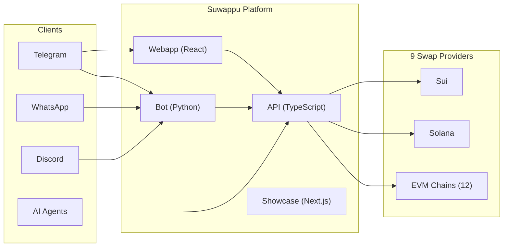
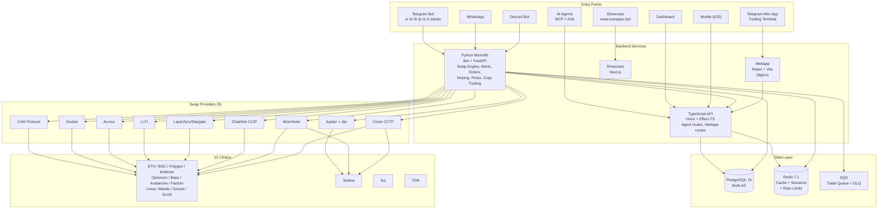
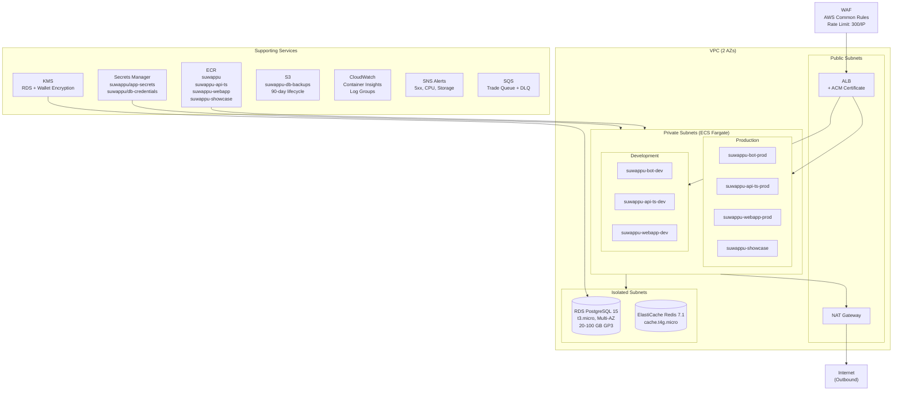
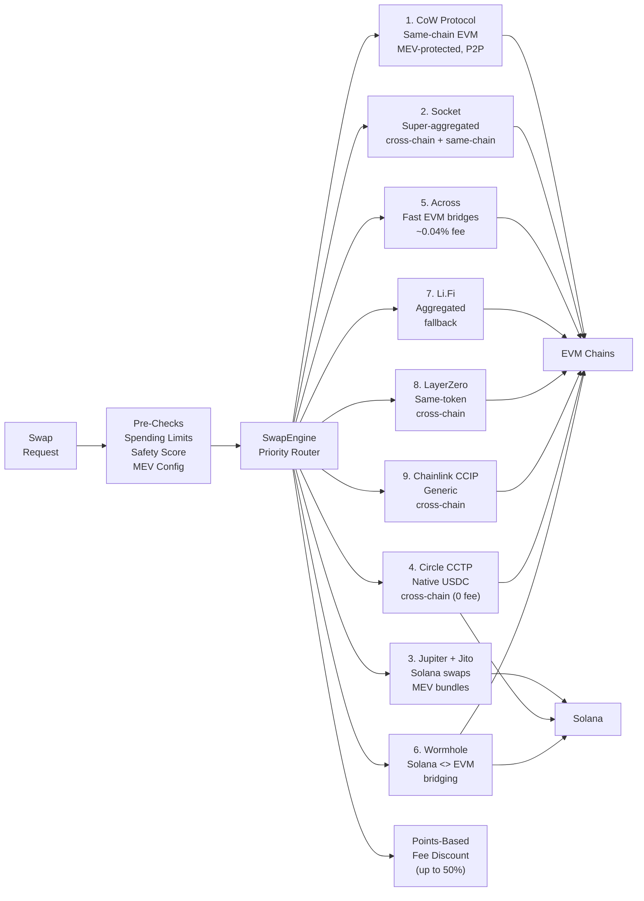
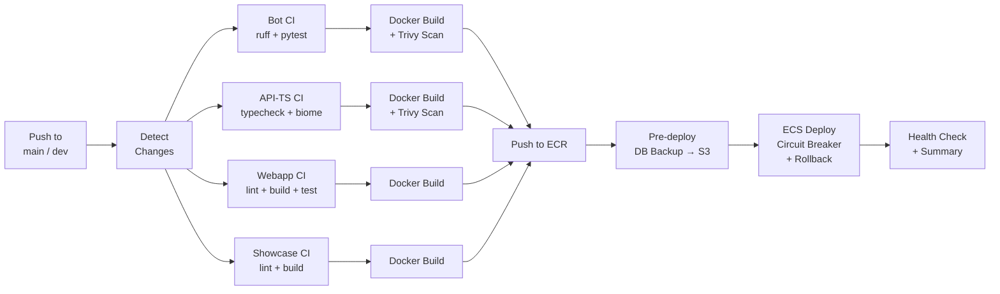
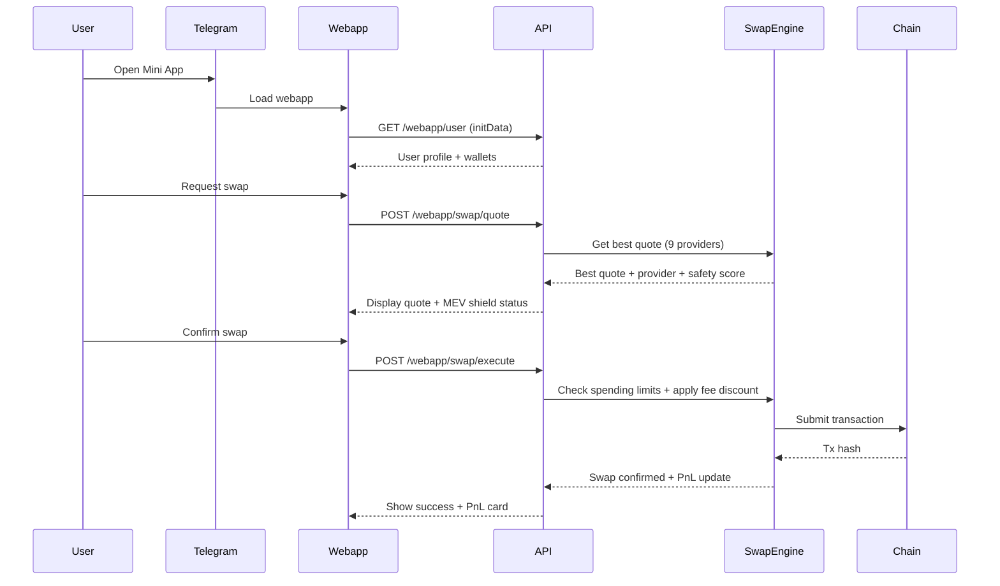

# Suwappu 🌸

Cross-chain DEX bot & liquidity infrastructure for humans and AI agents.

[](docs/features/agent_integration.md)
[](agent-card.json)

## Overview



**Swap tokens across 15 chains** via Telegram, WhatsApp, Discord, or programmatic API.

| Feature | Description |
|---------|-------------|
| **Cross-Chain Swaps** | 12 EVM chains + Solana + Sui + TON |
| **9 Swap Providers** | CoW, Socket, Jupiter, CCTP, Across, Wormhole, Li.Fi, LayerZero, Chainlink |
| **MEV Protection** | CoW Protocol (EVM) + Jito bundles (Solana) |
| **Web Trading Terminal** | TradingView charts, token discovery, quick-trade |
| **Advanced Orders** | Limit, DCA, trailing stop-loss, multi take-profit |
| **Copy Trading** | Smart money tracking with auto-mirror |
| **AI-Powered Analysis** | Natural language trades, token safety analysis |
| **Perps Trading** | HyperLiquid integration with TP/SL |
| **Security** | 2FA, whitelisting, spending limits, AES-256-GCM wallets |
| **Agent API** | MCP + A2A ready for AI integrations |

---

## Features

### Phase 1 — Table Stakes

- **MEV Protection** — User-toggleable shield. CoW Protocol for EVM, Jito bundles for Solana. Shield indicator on every swap quote.
- **Token Safety Scoring** — GoPlus Security integration for all users. Honeypot detection, liquidity lock status, top holder concentration.
- **PnL Tracking** — Realized and unrealized PnL per position with average cost basis and price capture at execution.
- **TON Chain Support** — TON Connect SDK, STON.fi DEX integration, Jetton token support.

### Phase 2 — Competitive Edge

- **Advanced Order Types** — DCA scheduling, limit orders, trailing stop-loss, multi take-profit targets, buy-the-dip automation.
- **Gamification** — Points-based tier system (Bronze/Silver/Gold/Diamond), daily quests, jackpot pool, volume cashback tiers, daily check-ins.
- **Multi-Tier Referrals** — 3-tier commission structure (25%/5%/2%), 10% fee discount for referred users, referral network view.
- **Quick-Trade UX** — Preset buy amounts, post-swap PnL card with quick-sell buttons, guided first-trade flow.
- **Smart Notifications** — PnL alerts, notification batching, quiet hours, actionable inline buttons.

### Phase 3 — Differentiation

- **Web Trading Terminal** — Telegram Mini App with TradingView charts (lightweight-charts), token discovery dashboard, trending tokens, token detail pages, fullscreen mode.
- **Enhanced Copy Trading** — Real-time smart money tracking, auto-sell mirroring, configurable modes, filtered leaderboard.
- **Telegram Stars Monetization** — Native in-app payments for Pro (500 Stars) and Premium (1500 Stars) subscription tiers.
- **Anti-Rug Protection** — Post-purchase token monitoring with 60s background checks for liquidity drops, tax increases, ownership changes. Emergency auto-sell.
- **AI-Powered Features** — Claude API integration for natural language trade parsing (multi-language), token safety analysis, portfolio summaries.

### Phase 4 — Expansion

- **New Chains** — Sui (Aftermath/Cetus routing, Ed25519 wallets), Monad, Berachain, Mantle, Gnosis, Scroll, plus 4 additional EVM chains.
- **Perps Trading** — HyperLiquid REST client for 10 markets, position management with TP/SL, background monitor, `/perps` Telegram command.
- **Security Hardening** — TOTP 2FA via pyotp, withdrawal address whitelisting with 24h cooldown, Redis-backed spending limits, audit logging, backup codes.
- **Points-Based Tiers** — Fee discounts up to 50% based on accumulated points. Replaced token staking model.
- **Trade Queue** — SQS-backed async trade processing with DLQ and inline fallback, circuit breaker pattern for RPC failover.
- **Discord Bot** — Modular discord.py bot with `/swap`, `/wallet`, `/portfolio`, `/price`, `/long`, `/short`, `/positions`, whale alerts, trending tokens, daily leaderboard.

---

## Architecture

### System Overview



### AWS Infrastructure



**Domains:**

| Environment | Bot | API (TS) | Webapp | Showcase |
|-------------|-----|----------|--------|----------|
| **Production** | bot.suwappu.bot | api.suwappu.bot | app.suwappu.bot | www.suwappu.bot |
| **Development** | devbot.suwappu.bot | devapi.suwappu.bot | devfront.suwappu.bot | — |

### Swap Routing

The SwapEngine orchestrates 9 providers with priority-based routing:



### CI/CD Pipeline



### Data Flow



---

## Supported Chains

| Chain | ID | Native | Type | Status |
|-------|-----|--------|------|--------|
| Ethereum | 1 | ETH | EVM | Live |
| BSC | 56 | BNB | EVM | Live |
| Polygon | 137 | MATIC | EVM | Live |
| Arbitrum | 42161 | ETH | EVM | Live |
| Optimism | 10 | ETH | EVM | Live |
| Base | 8453 | ETH | EVM | Live |
| Avalanche | 43114 | AVAX | EVM | Live |
| Fantom | 250 | FTM | EVM | Live |
| Linea | 59144 | ETH | EVM | Live |
| Mantle | 5000 | MNT | EVM | Live |
| Gnosis | 100 | xDAI | EVM | Live |
| Scroll | 534352 | ETH | EVM | Live |
| Solana | — | SOL | Solana | Live |
| Sui | — | SUI | Move | Live |
| TON | — | TON | TON | Live |

**Swap Providers:** CoW Protocol, Socket, Jupiter + Jito, Circle CCTP, Across, Wormhole, Li.Fi, LayerZero/Stargate, Chainlink CCIP

---

## Bot Commands

### Trading

| Command | Description |
|---------|-------------|
| `/s` | Quick swap — `/s <amount> <token>` |
| `/snipe` | Token sniping |
| `/o` | Limit orders, DCA, trailing stops |
| `/traders` | Copy trading |
| `/perps` | Perpetuals trading (HyperLiquid) |

### Portfolio

| Command | Description |
|---------|-------------|
| `/w` | Wallet management |
| `/b` | Check balances (all chains) |
| `/p` | Portfolio overview with PnL |
| `/hx` | Transaction history |
| `/tax` | Tax export (CSV) |
| `/f` | Favorite tokens |
| `/g` | Gas tracker |
| `/a` | Price alerts |

### Engagement

| Command | Description |
|---------|-------------|
| `/xp` | Points & tier status |
| `/checkin` | Daily check-in (earn points) |
| `/ref` | Referral program (3-tier) |
| `/set` | Settings (MEV, notifications, 2FA) |

### Admin

| Command | Description |
|---------|-------------|
| `/st` | Bot statistics |
| `/hw` | Hot wallet management |
| `/fee` | Fee settings |
| `/m` | Metrics dashboard |

---

## Quick Start

### Prerequisites

- [Bun](https://bun.sh) v1.3+
- PostgreSQL 14+
- Telegram Bot Token

### Local Development

```bash
# Clone
git clone https://github.com/0xSoftBoi/suwappubot.git
cd suwappubot

# API (TypeScript)
cd api-ts
bun install
cp .env.example .env
bun run dev

# Webapp (separate terminal)
cd webapp
bun install
bun run dev

# Bot (Python - optional)
cd bot
python -m venv venv && source venv/bin/activate
pip install -r requirements.txt
python -m bot.main
```

### Docker

```bash
# Full stack local
docker-compose -f docker-compose.local.yml up

# Production (webhook mode)
docker-compose up
```

---

## Project Structure

```
suwappubot/
├── api/              # Python FastAPI (webhook handlers, legacy API)
├── api-ts/           # TypeScript API (Hono + Effect-TS + Drizzle)
├── bot/              # Python Telegram bot
│   ├── handlers/     # 27 command handlers
│   ├── services/     # 49 service modules (swap, PnL, alerts, copy, perps, security)
│   ├── models/       # SQLAlchemy models
│   └── config/       # Chain configs, token configs, settings
├── webapp/           # Telegram Mini App (React + Vite) — trading terminal
├── showcase/         # Homepage (Next.js) → www.suwappu.bot
├── dashboard/        # Admin Dashboard (Turnkey EWK)
├── mobile/           # Expo iOS Mobile App
├── tui/              # Terminal Monitoring Dashboard
├── packages/shared/  # Shared TypeScript types (api-ts, webapp, mobile)
├── infra/            # AWS CDK infrastructure
├── database/         # DB init + runtime migrations
├── scripts/          # Utility scripts (sw worktree manager, db-backup)
├── cpp/              # C++ core for high-performance math
├── tests/            # Python unit & integration tests
├── docs/             # Centralized documentation
│   ├── architecture/ # Design & roadmap
│   ├── deployment/   # AWS, CI/CD, releases
│   ├── development/  # Setup, debug, migrations
│   ├── features/     # Feature-specific guides
│   ├── operations/   # Health, post-mortems, fixes
│   └── archive/      # Historical docs
└── .github/workflows/# CI/CD pipelines (4 deploy + 1 CI + 1 rollback)
```

---

## Documentation

| Category | Description | Key Links |
|-----------|-------------|--------|
| **Core Components** | Service-specific readmes | [API (TS)](api-ts/README.md) - [Webapp](webapp/README.md) - [Bot](bot/) - [Infra](infra/README.md) |
| **Architecture** | High-level design | [Scaling Guide](docs/architecture/scaling_guide.md) |
| **Development** | Setup & Debugging | [Debug Guide](docs/development/debug.md) - [Local Setup](docs/development/local_setup.md) - [Migrations](docs/development/migrations.md) |
| **Deployment** | AWS, CI/CD, Releases | [AWS Guide](docs/deployment/aws_deployment.md) - [CI/CD](docs/deployment/ci_cd.md) - [Releasing](docs/deployment/releasing.md) |
| **Features** | Swaps, Agents, Mobile | [Agent Integration](docs/features/agent_integration.md) - [Mobile Plan](docs/features/mobile_plan.md) |
| **Operations** | Health & Improvements | [Health Check](docs/operations/health_check.md) - [Improvements](docs/operations/improvements.md) |

---

## Agent Integration

Suwappu supports three protocols for AI agent integration. All share the same authentication and capabilities.

| Protocol | Endpoint | Best For |
|----------|----------|----------|
| **REST API** | `/v1/agent/*` | Direct integration, backends, scripts |
| **MCP** | `/mcp` | Claude Desktop, Claude Code, Cursor |
| **A2A** | `/a2a` | Agent-to-agent communication, orchestration |

### Quick Start: MCP (Claude Desktop)

Add to your Claude Desktop config (`~/Library/Application Support/Claude/claude_desktop_config.json`):

```json
{
  "mcpServers": {
    "suwappu": {
      "url": "https://api.suwappu.bot/mcp",
      "headers": {
        "Authorization": "Bearer suwappu_sk_YOUR_KEY"
      }
    }
  }
}
```

Or use the local stdio server:

```bash
npm install -g @suwappu/mcp-server
SUWAPPU_API_KEY=suwappu_sk_YOUR_KEY npx @suwappu/mcp-server
```

### Quick Start: A2A

```bash
# Discover agent capabilities
curl https://api.suwappu.bot/.well-known/agent.json

# Send a natural language message
curl -X POST https://api.suwappu.bot/a2a \
  -H "Authorization: Bearer suwappu_sk_YOUR_KEY" \
  -H "Content-Type: application/json" \
  -d '{"jsonrpc":"2.0","id":1,"method":"message/send","params":{"message":{"role":"user","parts":[{"type":"text","text":"swap 0.5 ETH to USDC on base"}]}}}'
```

### npm Packages

| Package | Description |
|---------|-------------|
| [`@suwappu/mcp-server`](https://www.npmjs.com/package/@suwappu/mcp-server) | MCP server (stdio transport) |
| [`@suwappu/sdk`](https://www.npmjs.com/package/@suwappu/sdk) | TypeScript SDK + `suwappu` trading CLI |
| [`@suwappu/langchain-suwappu`](https://www.npmjs.com/package/@suwappu/langchain-suwappu) | LangChain toolkit integration |

### Registry Listings

- [Smithery.ai](https://smithery.ai) — MCP server registry
- [awesome-a2a](https://github.com/ai-boost/awesome-a2a) — A2A protocol directory ([PR #36](https://github.com/ai-boost/awesome-a2a/pull/36))

See [gitbook/protocols/](gitbook/protocols/README.md) for full protocol documentation.

---

## Deployment

### Environments

All services run in a single `suwappu-cluster` on ECS Fargate.

| Environment | Bot | API (TS) | Webapp | Showcase | Branch |
|-------------|-----|----------|--------|----------|--------|
| **Production** | bot.suwappu.bot | api.suwappu.bot | app.suwappu.bot | www.suwappu.bot | `main` |
| **Development** | devbot.suwappu.bot | devapi.suwappu.bot | devfront.suwappu.bot | — | `dev` |

### CI/CD

Push to `main` or `dev` triggers GitHub Actions per service (path-filtered). Pipeline: Docker build → Trivy scan → ECR push → pre-deploy DB backup → ECS deploy with circuit breaker + rollback → health check.

See [docs/deployment/aws_deployment.md](docs/deployment/aws_deployment.md) for details.

---

## Security

- **Wallet Encryption** — AES-256-GCM envelope encryption with AWS KMS (auto-migrates from legacy Fernet v1)
- **Two-Factor Auth** — TOTP 2FA via pyotp with backup codes
- **Withdrawal Whitelisting** — Pre-approved addresses with 24h cooldown for new additions
- **Spending Limits** — Configurable daily/weekly limits tracked via Redis
- **Audit Logging** — All security-sensitive actions are logged
- **Token Safety** — GoPlus Security API for honeypot detection, liquidity analysis, holder concentration
- **Anti-Rug Protection** — Background monitoring with emergency auto-sell
- **Telegram Auth** — HMAC validation for all bot interactions
- **WAF** — AWS WAF with rate limiting (300 req/IP)
- **HTTPS** — Required in all environments

Report vulnerabilities to security@suwappu.bot

---

## Contributing

1. Fork & create feature branch
2. Follow existing patterns
3. Add tests for new features
4. PR with description

### Code Style

- **TypeScript:** Effect-TS patterns, strict mode
- **React:** Functional components, hooks
- **Python:** Type hints, async/await

---

## License

MIT

---

## Links

- **Production:** https://app.suwappu.bot
- **API Docs:** https://api.suwappu.bot/docs
- **Telegram Bot:** [@SuwappuBot](https://t.me/SuwappuBot)
