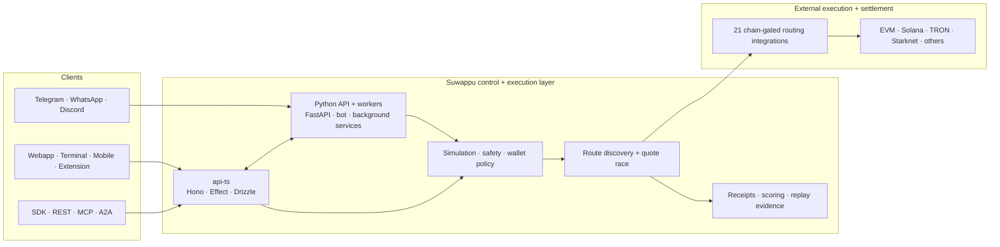

<div align="center">
  <a href="https://www.suwappu.bot">
    
  </a>
</div>

<h1 align="center">Suwappu</h1>

<p align="center">
  <b>Cross-chain execution infrastructure for humans, apps, and AI agents.</b><br>
  Trade across chains from chat or terminal; integrate the same execution layer through SDKs, REST, MCP, or A2A.
</p>

<div align="center">

[](https://www.suwappu.bot)
[](.github/workflows/test.yml)
[](.github/workflows/codeql.yml)
[](.github/workflows/scorecard.yml)
[](LICENSE)

[](showcase/src/data/stats.generated.json)
[](showcase/src/data/stats.generated.json)
[](showcase/src/data/stats.generated.json)

</div>

<p align="center">
  <b><a href="https://www.suwappu.bot">Explore Suwappu</a></b> &nbsp;·&nbsp;
  <b><a href="https://terminal.suwappu.bot">Open Terminal</a></b> &nbsp;·&nbsp;
  <b><a href="https://t.me/SuwappuBot">Telegram</a></b> &nbsp;·&nbsp;
  <b><a href="docs/quickstart.md">Quickstart</a></b> &nbsp;·&nbsp;
  <b><a href="docs/agent-clients.md">Build with Suwappu</a></b> &nbsp;·&nbsp;
  <b><a href="SECURITY.md">Security</a></b>
</p>

<table>
<tr>
<td width="50%" valign="top">

<a href="https://www.suwappu.bot"></a>

<sub>**[suwappu.bot](https://www.suwappu.bot)** — products, research, and developer entry points.</sub>

</td>
<td width="50%" valign="top">

<a href="https://terminal.suwappu.bot"></a>

<sub>**[terminal.suwappu.bot](https://terminal.suwappu.bot)** — charts, markets, swaps, orders, and portfolio.</sub>

</td>
</tr>
</table>

---

## Start here

Suwappu is one execution layer with multiple ways in. Pick the shortest path for what you are building.

| I want to… | Start here |
|---|---|
| **Trade** | [Terminal](https://terminal.suwappu.bot) · [Telegram](https://t.me/SuwappuBot) · [feature guides](docs/features/README.md) |
| **Give an AI agent market + execution tools** | [5-minute quickstart](docs/quickstart.md#build-an-agent) · [MCP / SDK / REST / A2A guide](docs/agent-clients.md) |
| **Integrate Suwappu into an app** | [`@suwappu/sdk`](packages/sdk/README.md) · [Python SDK](packages/sdk-python/README.md) · [Agent REST](docs/agent-clients.md#agent-rest-custody-map) |
| **Understand the system** | [Architecture overview](docs/architecture/OVERVIEW.md) · [architecture decisions](ARCHITECTURE.md) |
| **Contribute** | [Onboarding](docs/ONBOARDING.md) · [Contributing](CONTRIBUTING.md) · [Conventions](CONVENTIONS.md) |
| **Operate it** | [Production inventory](docs/deployment/production-inventory.md) · [Railway](docs/deployment/railway.md) · [Monitoring](docs/deployment/monitoring.md) |

> **Money-moving APIs are explicit by design.** MCP `execute_swap` prepares an unsigned self-custody transaction; managed server-side execution is a separate REST capability. A2A is quote/discovery only today. See [Custody and execution boundaries](#custody-and-execution-boundaries).

---

## What Suwappu is

Most trading products are a frontend attached to one venue. Suwappu is the layer underneath the frontend:

1. **Normalize an intent** — asset, amount, chains, slippage, policy, custody mode.
2. **Discover eligible routes** — only providers that support that route are considered.
3. **Race quotes in parallel** — compare eligible routes instead of hard-coding one venue.
4. **Apply safety and execution policy** — simulation, limits, token checks, MEV policy, and custody controls.
5. **Execute or prepare** — managed execution and self-custody preparation are different capabilities.
6. **Observe the outcome** — record route candidates, selected routes, execution marks, and settlement evidence.

The generated source of truth currently reports **45 platform chains, 18 Agent API chains, and 21 chain-gated routing integrations**. Those numbers change as integrations land; do not assume every route uses every provider. See [`showcase/src/data/stats.generated.json`](showcase/src/data/stats.generated.json).

### Product surfaces

| Surface | Best for |
|---|---|
| **Terminal / web** | Interactive trading, charts, orders, portfolio, market discovery |
| **Telegram** | Full conversational trading workflow and alerts |
| **WhatsApp / Discord** | Messaging-native workflows and notifications |
| **SDK / REST** | Application integrations with explicit custody boundaries |
| **Hosted MCP** | Structured tools for AI clients and agents |
| **A2A** | Natural-language quote, price, and discovery requests |
| **Browser extension / mobile** | Wallet and native-client surfaces |

---

## Build on Suwappu in five minutes

Register an agent credential:

```bash
curl -X POST https://api.suwappu.bot/v1/agent/register \
  -H 'Content-Type: application/json' \
  -d '{"name":"my-agent"}'
```

Store the returned `suwappu_sk_...` as `SUWAPPU_API_KEY`, then point an MCP client at the hosted server:

```json
{
  "mcpServers": {
    "suwappu": {
      "url": "https://api.suwappu.bot/mcp",
      "headers": {
        "Authorization": "Bearer suwappu_sk_..."
      }
    }
  }
}
```

Discover capabilities at runtime with `tools/list`; do not copy a static tool registry into your client. The hosted catalog currently exposes **22 tools** spanning quotes, prices, portfolio, simulation, predictions, perps, lending, managed-swap observability, and wallet policy.

For SDK, REST, A2A, client-specific MCP configuration, and version boundaries, use the [full integration guide](docs/agent-clients.md).

---

## Custody and execution boundaries

The same word — “swap” — can mean very different things at a wallet boundary. Suwappu keeps those paths separate.

| Surface | Transaction boundary |
|---|---|
| **Hosted MCP** | `execute_swap` prepares an **unsigned self-custody transaction** |
| **TypeScript / Python SDK** | Explicit self-custody `prepare*` methods vs managed `executeManaged*` methods |
| **Agent REST** | `POST /v1/agent/swap` prepares; `POST /v1/agent/swap/execute` performs managed execution |
| **A2A** | Quotes, prices, and discovery; **no execution method today** |

For money-moving products, start read-only, keep an application-owned tool allowlist, simulate unfamiliar routes, and make managed execution an explicit opt-in. See [agent security baseline](docs/agent-clients.md#security-baseline-for-builders).

---

## Capabilities

### Execution

- **Cross-chain and same-chain swaps** — chain-gated providers raced in parallel; best eligible quote selected.
- **Limit + DCA orders** — scheduled and price-triggered execution.
- **Perpetuals** — HyperLiquid markets and position workflows.
- **Predictions** — market discovery and trading workflows.
- **Lending and savings** — lending-market discovery and position workflows.
- **BTC bridging** — Bitcoin bridge integrations.
- **Sniping + copy trading** — launch and trader-following workflows.
- **MEV-aware paths** — provider-specific protection such as CoW and Jito where the route supports it.

### Safety and policy

- Transaction simulation before execution.
- Token safety scoring, honeypot and authority checks.
- AES-256-GCM envelope encryption and key-management integrations.
- Turnkey-backed wallet flows.
- TOTP 2FA, configurable spending limits, and withdrawal whitelists.
- Audit logging and supply-chain inventory through a checked-in CycloneDX SBOM.

### Agent platform

- **REST** — explicit low-level application API.
- **MCP** — hosted structured tool surface with resources and prompts.
- **A2A** — natural-language quote / price / discovery surface.
- **SDKs** — TypeScript and Python clients with custody-aware APIs.
- **Framework examples** — LangChain, CrewAI, OpenClaw, MCP advisor, and natural-language CLI examples.

### Protocol and execution R&D

The monorepo also contains work that is deliberately **not represented as production routing authority**:

- [`contracts/primitives/`](contracts/primitives/) — immutable TimeCurve, self-amortizing ERC-4626 vault, and mutual-credit primitives with Foundry tests and a mainnet-readiness checklist.
- `bot/services/execution_sync*.py` — shadow execution synchronization, provider calibration, normalized receipts, and historical / walk-forward replay. It is read-only evidence infrastructure today; production routing remains authoritative until a controlled promotion process proves otherwise.

That distinction is intentional: experimental or shadow systems should be inspectable without being marketed as live money-path behavior.

---

## Architecture



The runtime is larger than this conceptual diagram. Production now includes dedicated workers, bridge/relayer services, signal/on-chain ingestion services, Postgres, and Redis. See the [production inventory](docs/deployment/production-inventory.md) instead of inferring deploy topology from source directories.

---

## Engineering discipline

Suwappu is a fast-moving monorepo, so documentation and safety mechanisms are treated as code contracts rather than wiki prose:

- **Generated capability stats** — chain and router counts are generated and drift-gated; the README links to the source instead of inventing another truth.
- **Environment contract** — [`.env.schema`](.env.schema) and [`capabilities.yaml`](capabilities.yaml) describe required/optional configuration; `python3 scripts/doctor.py` probes local readiness.
- **Architecture decisions** — ADRs are append-only; [`docs/DECISIONS.md`](docs/DECISIONS.md) captures operational lessons.
- **Docs drift gate** — `./scripts/verify.sh docs` checks repository-path references as part of verification.
- **Money-path review boundary** — key custody and execution modules require adversarial review.
- **Supply-chain controls** — CodeQL, OpenSSF Scorecard, SHA-pinned security workflows, and a checked-in CycloneDX SBOM.
- **Incident + migration runbooks** — operational knowledge lives beside the code, not in chat history.

Start with the [documentation index](docs/README.md) if you are trying to understand why the system looks the way it does.

---

## Repository map

```text
suwappubot/
├── api-ts/             # TypeScript API: agent, MCP, A2A, webapp and execution routes
├── api/                # Python FastAPI entry points
├── bot/                # Telegram bot, execution engine, services, workers and models
├── webapp/             # React/Vite web application
├── terminal/           # Trading terminal / Mini App surface
├── mobile/             # Expo iOS client
├── extension/          # Browser wallet extension (MV3)
├── showcase/           # Public website and research/product directory
├── contracts/          # Solidity contracts and protocol primitives
├── packages/
│   ├── sdk/            # @suwappu/sdk
│   ├── sdk-python/     # Python SDK
│   ├── mcp-server/     # stdio -> hosted MCP bridge
│   ├── openclaw/       # OpenClaw integration
│   └── design-tokens/  # shared design tokens
├── docs/               # architecture, product, security, operations, plans, research
├── gitbook/            # API reference material
├── database/           # schema/bootstrap and runtime migrations
├── scripts/            # verification, replay, maintenance and operational tooling
├── monitoring/         # health/monitoring manifests
├── sbom/               # CycloneDX software bill of materials
└── .github/workflows/  # CI, security and deployment workflows
```

For the descriptive runtime map, read [`docs/architecture/OVERVIEW.md`](docs/architecture/OVERVIEW.md). For normative system boundaries and standing decisions, read [`ARCHITECTURE.md`](ARCHITECTURE.md).

---

## Local development

```bash
# Check which capabilities your environment can actually support
python3 scripts/doctor.py

# TypeScript API
cd api-ts && bun install && bun run dev

# Python API / bot
python -m venv venv && source venv/bin/activate
pip install -r requirements.txt
uvicorn api.main:app --host 0.0.0.0 --port 8000 --reload

# Webapp
cd webapp && npm install && npm run dev
```

Each service has its own configuration boundary. Use [`.env.schema`](.env.schema) rather than copying environment variables from an old deployment document.

Before a docs-only PR:

```bash
./scripts/verify.sh docs
```

See [ONBOARDING](docs/ONBOARDING.md) for the full contributor setup and test lanes.

---

## Security

Suwappu moves money. Treat any change to signing, custody, routing, withdrawals, fee collection, or authorization as security-sensitive.

- Read [SECURITY.md](SECURITY.md) before reporting a vulnerability.
- Review the [architecture overview](docs/architecture/OVERVIEW.md#wallets--keys-money-path) for key-handling boundaries.
- Review [agent clients](docs/agent-clients.md#security-baseline-for-builders) before granting an AI system execution capabilities.
- The checked-in [CycloneDX SBOM](sbom/suwappubot.cdx.json) inventories dependencies; it is not a security certification.

Suwappu does **not** claim that repository scanning, SBOM generation, or security automation is equivalent to an audit or SOC 2 certification.

---

## Documentation

| Resource | What it answers |
|---|---|
| [Quickstart](docs/quickstart.md) | What is the shortest path to trading, an agent, an app integration, or local development? |
| [Docs index](docs/README.md) | Where does each kind of knowledge live? |
| [Agent clients](docs/agent-clients.md) | How do MCP, SDK, REST, A2A, auth, and custody differ? |
| [Feature guides](docs/features/README.md) | What can users do and where? |
| [Architecture overview](docs/architecture/OVERVIEW.md) | What runs and how do requests/data flow? |
| [Production inventory](docs/deployment/production-inventory.md) | What services make up the current Railway runtime? |
| [ADRs](docs/adr/README.md) · [Decisions](docs/DECISIONS.md) | Why were important choices made? |
| [Onboarding](docs/ONBOARDING.md) | How do contributors run and verify the monorepo? |
| [Security](SECURITY.md) · [Support](SUPPORT.md) | How do I report vulnerabilities or get help? |

## License

Apache-2.0. See [LICENSE](LICENSE).
