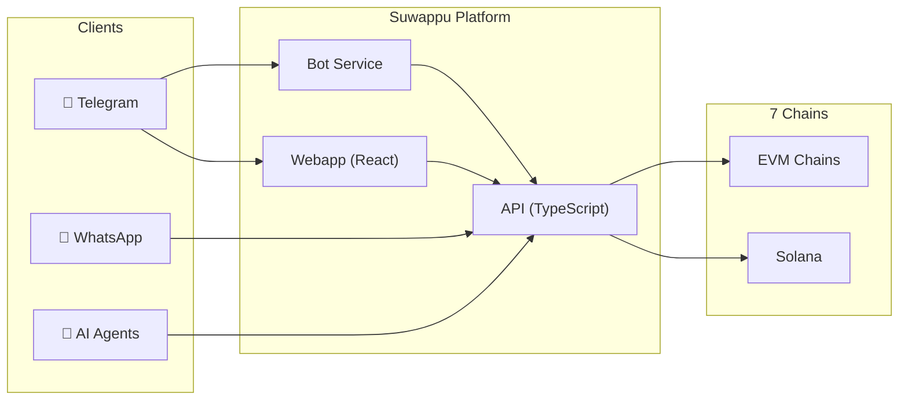
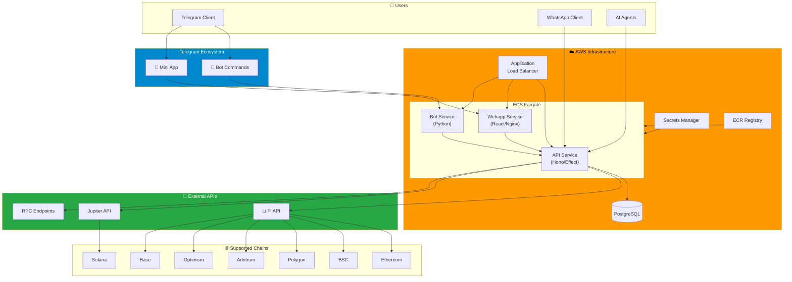
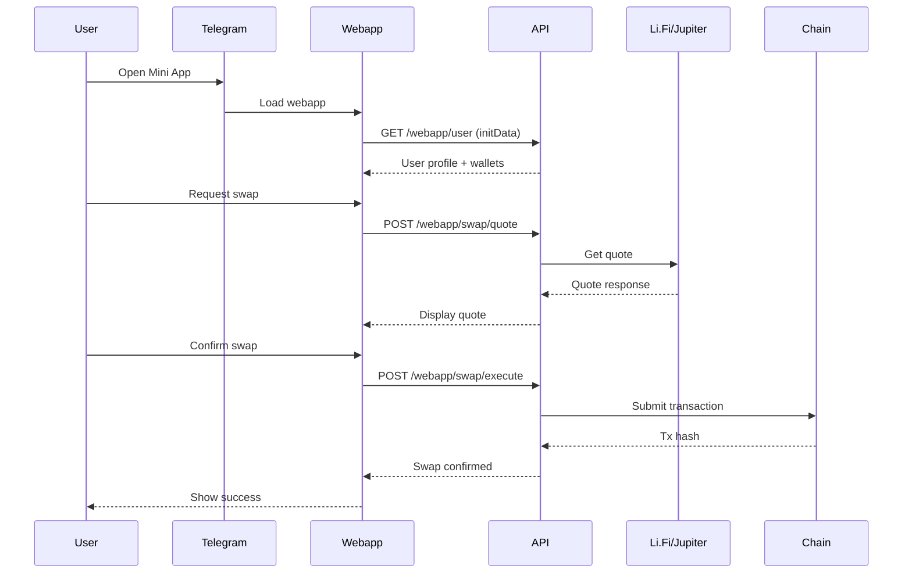
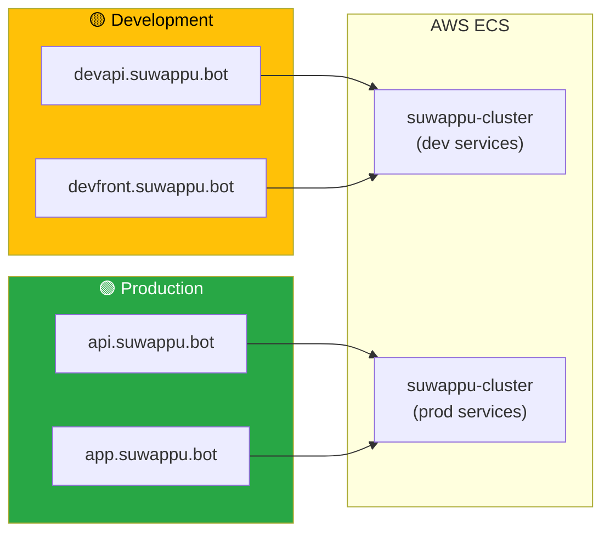
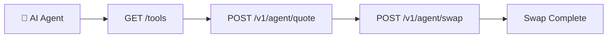

# Suwappu 🌸

Cross-chain DEX bot & liquidity infrastructure for humans and AI agents.

[](docs/README_AGENT.md)
[](agent-card.json)

## Overview



**Swap tokens across 7 chains** via Telegram, WhatsApp, or programmatic API.

| Feature | Description |
|---------|-------------|
| **Cross-Chain Swaps** | ETH, BSC, Polygon, Arbitrum, Optimism, Base, Solana |
| **Telegram Mini App** | Native in-app experience |
| **Agent API** | MCP + A2A ready for AI integrations |
| **Secure Wallets** | AES-256-GCM encrypted keys |

---

## 📚 Documentation

| Component | Description | README |
|-----------|-------------|--------|
| **API (TypeScript)** | Hono + Effect-TS backend | [api-ts/README.md](api-ts/README.md) |
| **Webapp** | React + Vite Mini App | [webapp/README.md](webapp/README.md) |
| **Bot** | Python Telegram handlers | [bot/](bot/) |
| **Infrastructure** | AWS CDK stacks | [infra/README.md](infra/README.md) |
| **Agent Integration** | MCP & A2A guide | [docs/README_AGENT.md](docs/README_AGENT.md) |

### Additional Docs

- [Deployment Guide](docs/DEPLOYMENT.md)
- [AWS Infrastructure](docs/AWS_DEPLOYMENT.md)
- [Scaling Guide](docs/SCALING_GUIDE.md)
- [Health Check](HEALTH_CHECK.md)

---

## Architecture

### System Overview



### Data Flow



### Deployment Environments



---

## Quick Start

### Prerequisites

- [Bun](https://bun.sh) v1.3+
- PostgreSQL 14+
- Telegram Bot Token

### Local Development

```bash
# Clone
git clone https://github.com/0xSoftBoi/suwappubot.git
cd suwappubot

# API (TypeScript)
cd api-ts
bun install
cp .env.example .env
bun run dev

# Webapp (separate terminal)
cd webapp
bun install
bun run dev

# Bot (Python - optional)
cd bot
python -m venv venv && source venv/bin/activate
pip install -r requirements.txt
python -m bot.main
```

### Docker

```bash
# Full stack local
docker-compose -f docker-compose.local.yml up

# Production (webhook mode)
docker-compose up
```

---

## Project Structure

```
suwappubot/
├── api-ts/           # TypeScript API (Hono + Effect)
│   ├── src/
│   │   ├── routes/   # API endpoints
│   │   ├── services/ # Business logic
│   │   └── db/       # Drizzle schema
│   └── README.md     # 📖 API docs
│
├── webapp/           # Telegram Mini App (React)
│   ├── src/
│   │   ├── pages/    # Route pages
│   │   ├── components/
│   │   └── theme/    # Design system
│   └── README.md     # 📖 Webapp docs
│
├── bot/              # Python Telegram bot
│   ├── handlers/     # Command handlers
│   └── services/     # Swap/wallet logic
│
├── infra/            # AWS CDK infrastructure
│   └── README.md     # 📖 Infra docs
│
├── docs/             # Additional documentation
│   ├── README_AGENT.md
│   ├── DEPLOYMENT.md
│   └── ...
│
├── .github/workflows/  # CI/CD pipelines
└── docker-compose.yml
```

---

## Supported Chains & Tokens

| Chain | ID | Tokens | Bridge |
|-------|-----|--------|--------|
| Ethereum | 1 | USDT, USDC, DAI, ETH | Li.Fi |
| BSC | 56 | USDT, BUSD, BNB | Li.Fi |
| Polygon | 137 | USDT, USDC, MATIC | Li.Fi |
| Arbitrum | 42161 | USDT, USDC, ETH | Li.Fi |
| Optimism | 10 | USDT, USDC, ETH | Li.Fi |
| Base | 8453 | USDT, USDC, ETH | Li.Fi |
| Solana | - | USDT, USDC, SOL | Jupiter |

---

## Bot Commands

| Command | Description |
|---------|-------------|
| `/start` | Start bot, show menu |
| `/swap` | Initiate cross-chain swap |
| `/balance` | Check wallet balances |
| `/wallet` | Wallet management |
| `/help` | Help & support |

---

## Agent Integration

Suwappu is designed for the **agentic economy**. AI agents can:



- **Tool Discovery:** `GET /tools`
- **MCP Manifest:** `GET /.well-known/ai-plugin.json`
- **Agent Card:** `GET /agent-card.json`

See [docs/README_AGENT.md](docs/README_AGENT.md) for integration guide.

---

## Deployment

### Environments

| Environment | API | Webapp | Branch |
|-------------|-----|--------|--------|
| **Production** | api.suwappu.bot | app.suwappu.bot | `main` |
| **Development** | devapi.suwappu.bot | devfront.suwappu.bot | `dev` |

### CI/CD

Push to `main` or `dev` triggers GitHub Actions → ECR → ECS deployment.

See [docs/DEPLOYMENT.md](docs/DEPLOYMENT.md) for details.

---

## Contributing

1. Fork & create feature branch
2. Follow existing patterns
3. Add tests for new features
4. PR with description

### Code Style

- **TypeScript:** Effect-TS patterns, strict mode
- **React:** Functional components, hooks
- **Python:** Type hints, async/await

---

## Security

- Private keys encrypted with AES-256-GCM
- Telegram auth via HMAC validation
- API keys for agent/admin endpoints
- HTTPS required in production

Report vulnerabilities to security@suwappu.bot

---

## License

MIT

---

## Links

- **Production:** https://app.suwappu.bot
- **API Docs:** https://api.suwappu.bot/docs
- **Telegram Bot:** [@SuwappuBot](https://t.me/SuwappuBot)
