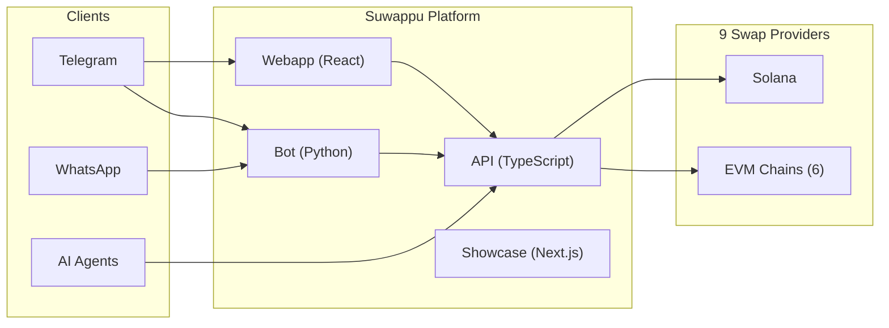
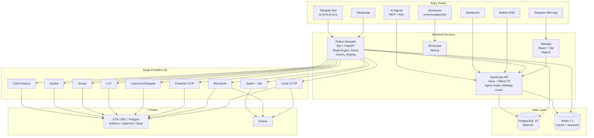
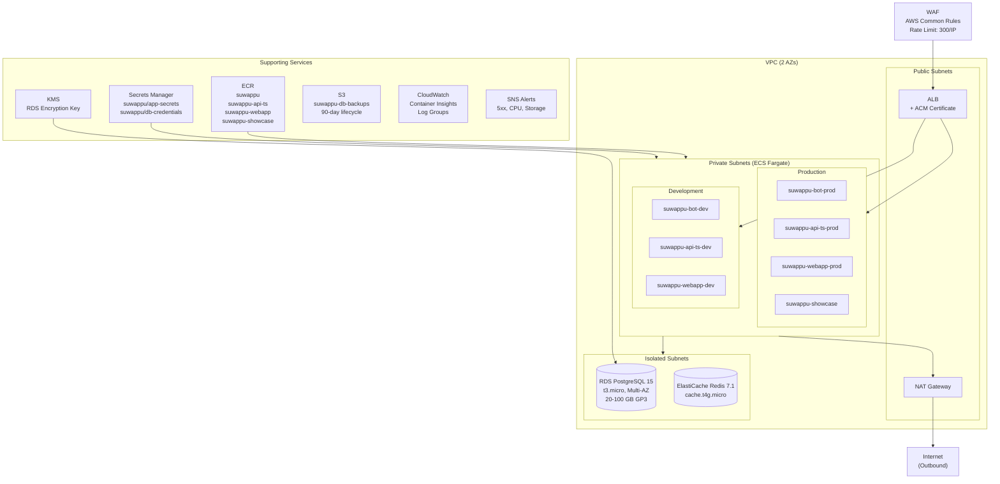
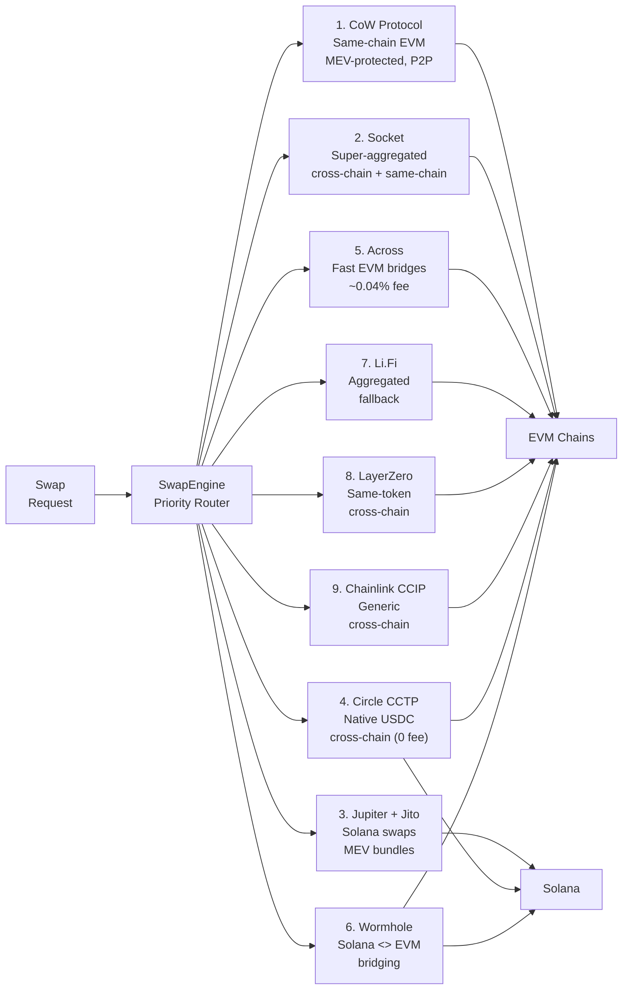
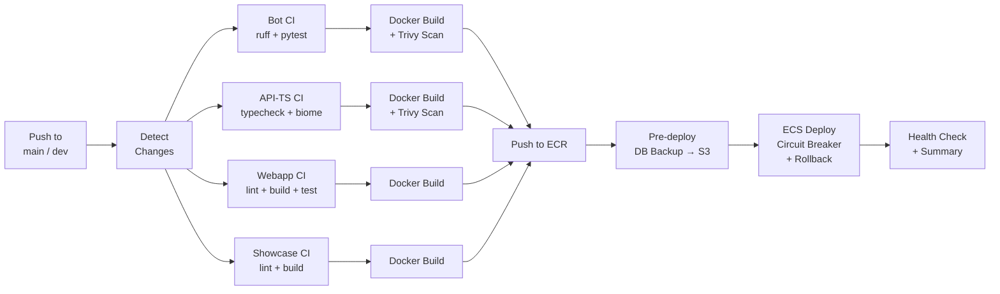
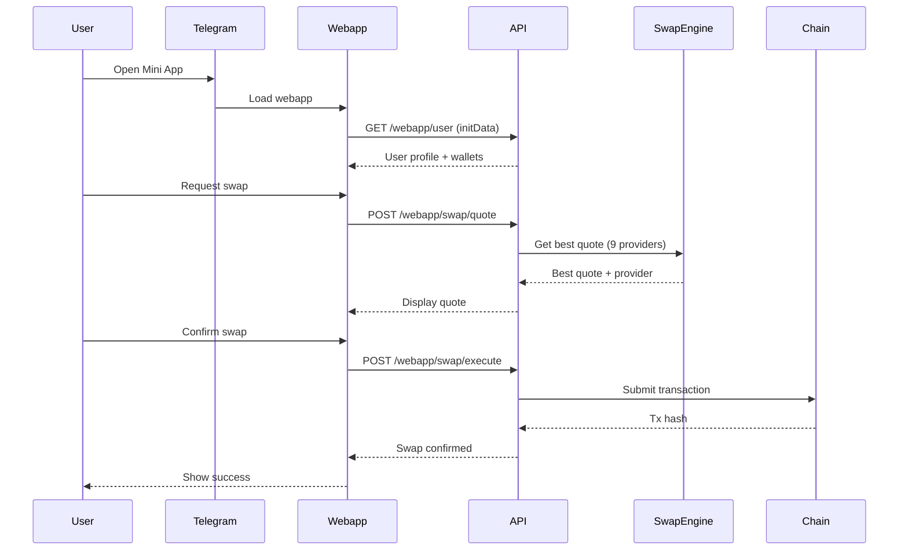
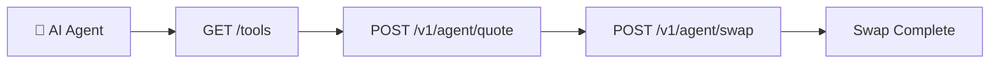

# Suwappu 🌸

Cross-chain DEX bot & liquidity infrastructure for humans and AI agents.

[](docs/features/agent_integration.md)
[](agent-card.json)

## Overview



**Swap tokens across 7 chains** via Telegram, WhatsApp, or programmatic API.

| Feature | Description |
|---------|-------------|
| **Cross-Chain Swaps** | ETH, BSC, Polygon, Arbitrum, Optimism, Base, Solana |
| **Telegram Mini App** | Native in-app experience |
| **Agent API** | MCP + A2A ready for AI integrations |
| **Secure Wallets** | AES-256-GCM encrypted keys |

---

## 📚 Documentation

| Category | Description | Key Links |
|-----------|-------------|--------|
| **Core Components** | Service-specific readmes | [API (TS)](api-ts/README.md) • [Webapp](webapp/README.md) • [Bot](bot/) • [Infra](infra/README.md) |
| **Architecture** | High-level design | [Scaling Guide](docs/architecture/scaling_guide.md) |
| **Development** | Setup & Debugging | [Debug Guide](docs/development/debug.md) • [Local Setup](docs/development/local_setup.md) • [Migrations](docs/development/migrations.md) |
| **Deployment** | AWS, CI/CD, Releases | [AWS Guide](docs/deployment/aws_deployment.md) • [CI/CD](docs/deployment/ci_cd.md) • [Releasing](docs/deployment/releasing.md) |
| **Features** | Swaps, Agents, Mobile | [Agent Integration](docs/features/agent_integration.md) • [Mobile Plan](docs/features/mobile_plan.md) |
| **Operations** | Health & Improvements | [Health Check](docs/operations/health_check.md) • [Improvements](docs/operations/improvements.md) |

---


## Architecture

### System Overview



### AWS Infrastructure



**Domains:**

| Environment | Bot | API (TS) | Webapp | Showcase |
|-------------|-----|----------|--------|----------|
| **Production** | bot.suwappu.bot | api.suwappu.bot | app.suwappu.bot | www.suwappu.bot |
| **Development** | devbot.suwappu.bot | devapi.suwappu.bot | devfront.suwappu.bot | — |

### Swap Routing

The SwapEngine orchestrates 9 providers with priority-based routing:



### CI/CD Pipeline



### Data Flow



---

## Quick Start

### Prerequisites

- [Bun](https://bun.sh) v1.3+
- PostgreSQL 14+
- Telegram Bot Token

### Local Development

```bash
# Clone
git clone https://github.com/0xSoftBoi/suwappubot.git
cd suwappubot

# API (TypeScript)
cd api-ts
bun install
cp .env.example .env
bun run dev

# Webapp (separate terminal)
cd webapp
bun install
bun run dev

# Bot (Python - optional)
cd bot
python -m venv venv && source venv/bin/activate
pip install -r requirements.txt
python -m bot.main
```

### Docker

```bash
# Full stack local
docker-compose -f docker-compose.local.yml up

# Production (webhook mode)
docker-compose up
```

---

## Project Structure

```
suwappubot/
├── api/              # Python FastAPI (webhook handlers, legacy API)
├── api-ts/           # TypeScript API (Hono + Effect-TS + Drizzle)
├── bot/              # Python Telegram bot (handlers, services, models)
├── webapp/           # Telegram Mini App (React + Vite)
├── showcase/         # Homepage (Next.js) → www.suwappu.bot
├── dashboard/        # Admin Dashboard
├── mobile/           # Expo iOS Mobile App
├── tui/              # Terminal Monitoring Dashboard
├── packages/shared/  # Shared TypeScript types (api-ts, webapp, mobile)
├── infra/            # AWS CDK infrastructure
├── database/         # DB init + runtime migrations
├── scripts/          # Utility scripts (sw worktree manager, db-backup)
├── cpp/              # C++ core for high-performance math
├── tests/            # Python unit & integration tests
├── docs/             # Centralized documentation
│   ├── architecture/ # Design & roadmap
│   ├── deployment/   # AWS, CI/CD, releases
│   ├── development/  # Setup, debug, migrations
│   ├── features/     # Feature-specific guides
│   ├── operations/   # Health, post-mortems, fixes
│   └── archive/      # Historical docs
└── .github/workflows/# CI/CD pipelines (4 deploy + 1 CI + 1 rollback)
```

---

## Supported Chains & Tokens

| Chain | ID | Native | Stables | Providers |
|-------|-----|--------|---------|-----------|
| Ethereum | 1 | ETH | USDT, USDC, DAI | CoW, Socket, Li.Fi, Across |
| BSC | 56 | BNB | USDT, BUSD | Socket, Li.Fi, Stargate |
| Polygon | 137 | MATIC | USDT, USDC | CoW, Socket, Li.Fi, Across |
| Arbitrum | 42161 | ETH | USDT, USDC | CoW, Socket, Li.Fi, Across |
| Optimism | 10 | ETH | USDT, USDC | CoW, Socket, Li.Fi, Across |
| Base | 8453 | ETH | USDT, USDC | CoW, Socket, Li.Fi, Across |
| Solana | — | SOL | USDT, USDC | Jupiter + Jito, Wormhole |

---

## Bot Commands

| Command | Description |
|---------|-------------|
| `/start` | Main menu |
| `/s` | Quick swap — `/s <amount> <token>` |
| `/w` | Wallet management |
| `/b` | Check balances |
| `/p` | Portfolio overview |
| `/a` | Price alerts |
| `/o` | Limit orders & DCA |
| `/snipe` | Token sniping |
| `/hx` | Transaction history |
| `/g` | Gas tracker |
| `/f` | Favorite tokens |
| `/ref` | Referral program |
| `/xp` | Points & XP |
| `/checkin` | Daily check-in |
| `/traders` | Copy trading |
| `/tax` | Tax export |
| `/set` | Settings |
| `/h` | Help |

---

## Agent Integration

Suwappu is designed for the **agentic economy**. AI agents can:



- **Tool Discovery:** `GET /tools`
- **MCP Manifest:** `GET /.well-known/ai-plugin.json`
- **Agent Skill:** [docs/features/agent_skill.md](docs/features/agent_skill.md)

See [docs/features/agent_integration.md](docs/features/agent_integration.md) for integration guide.

---

## Deployment

### Environments

All services run in a single `suwappu-cluster` on ECS Fargate.

| Environment | Bot | API (TS) | Webapp | Showcase | Branch |
|-------------|-----|----------|--------|----------|--------|
| **Production** | bot.suwappu.bot | api.suwappu.bot | app.suwappu.bot | www.suwappu.bot | `main` |
| **Development** | devbot.suwappu.bot | devapi.suwappu.bot | devfront.suwappu.bot | — | `dev` |

### CI/CD

Push to `main` or `dev` triggers GitHub Actions per service (path-filtered). Pipeline: Docker build → Trivy scan → ECR push → pre-deploy DB backup → ECS deploy with circuit breaker + rollback → health check.

See [docs/deployment/aws_deployment.md](docs/deployment/aws_deployment.md) for details.

---

## Contributing

1. Fork & create feature branch
2. Follow existing patterns
3. Add tests for new features
4. PR with description

### Code Style

- **TypeScript:** Effect-TS patterns, strict mode
- **React:** Functional components, hooks
- **Python:** Type hints, async/await

---

## Security

- Private keys encrypted with AES-256-GCM
- Telegram auth via HMAC validation
- API keys for agent/admin endpoints
- HTTPS required in production

Report vulnerabilities to security@suwappu.bot

---

## License

MIT

---

## Links

- **Production:** https://app.suwappu.bot
- **API Docs:** https://api.suwappu.bot/docs
- **Telegram Bot:** [@SuwappuBot](https://t.me/SuwappuBot)
