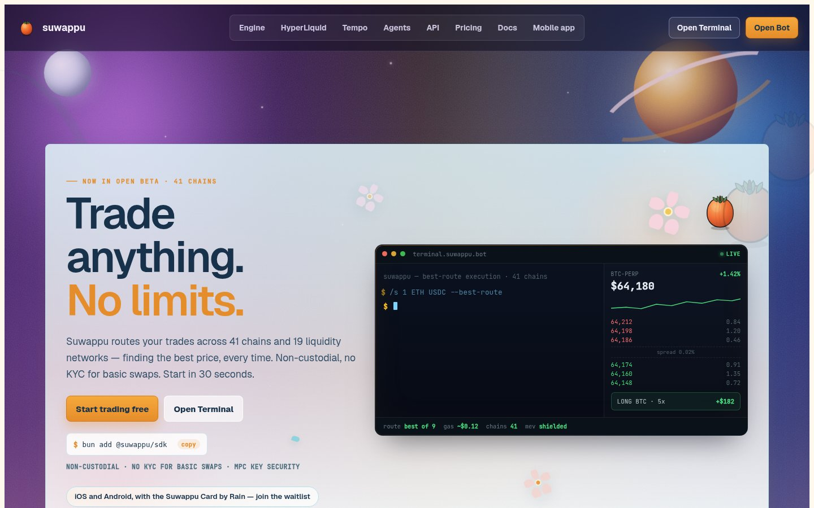
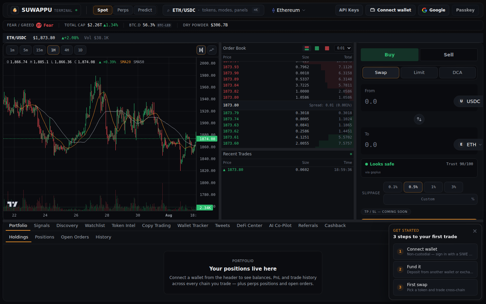
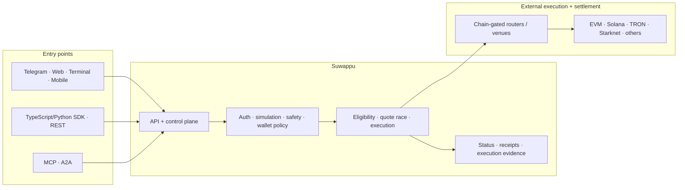

<div align="center">
  <a href="https://www.suwappu.bot">
    
  </a>
</div>

<h1 align="center">Suwappu</h1>

<p align="center">
  <b>The execution layer for onchain apps and agents.</b><br>
  Route across chains, simulate before money moves, and choose self-custody or managed execution from the same platform.
</p>

<div align="center">

[](https://www.suwappu.bot)
[](.github/workflows/test.yml)
[](.github/workflows/codeql.yml)
[](.github/workflows/scorecard.yml)
[](https://www.npmjs.com/package/@suwappu/sdk)
[](https://www.npmjs.com/package/@suwappu/sdk)
[](LICENSE)

[](showcase/src/data/stats.generated.json)
[](showcase/src/data/stats.generated.json)
[](showcase/src/data/stats.generated.json)

</div>

<p align="center">
  <b><a href="docs/quickstart.md">Quickstart</a></b> &nbsp;·&nbsp;
  <b><a href="https://terminal.suwappu.bot">Terminal</a></b> &nbsp;·&nbsp;
  <b><a href="https://t.me/SuwappuBot">Telegram</a></b> &nbsp;·&nbsp;
  <b><a href="docs/agent-clients.md">Developer Docs</a></b> &nbsp;·&nbsp;
  <b><a href="docs/product-status.md">Product Status</a></b> &nbsp;·&nbsp;
  <b><a href="SECURITY.md">Security</a></b>
</p>

<table>
<tr>
<td width="50%" valign="top">

<a href="https://www.suwappu.bot"></a>

<sub>**[suwappu.bot](https://www.suwappu.bot)** — products, research, and developer entry points.</sub>

</td>
<td width="50%" valign="top">

<a href="https://terminal.suwappu.bot"></a>

<sub>**[terminal.suwappu.bot](https://terminal.suwappu.bot)** — markets, charts, swaps, orders, and portfolio.</sub>

</td>
</tr>
</table>

---

## What can I build?

| Goal | Start here |
|---|---|
| **Add trading to an app** | [`@suwappu/sdk`](packages/sdk/README.md) · [Agent REST](docs/agent-clients.md) |
| **Give an AI agent market tools** | [Hosted MCP](docs/quickstart.md#build-an-agent) · [A2A](docs/agent-clients.md) |
| **Let a browser agent trade with a human in the loop** | [WebMCP Agent Desk](docs/webmcp.md) · [`/agent-terminal`](https://suwappu.bot/agent-terminal) |
| **Build a self-custody flow** | [Execution ladder](#the-execution-ladder) · [custody semantics](docs/agent-clients.md) |
| **Build managed execution** | [Agent REST](docs/agent-clients.md) · [security baseline](docs/agent-clients.md#security-baseline-for-builders) |
| **Trade directly** | [Terminal](https://terminal.suwappu.bot) · [Telegram](https://t.me/SuwappuBot) |
| **Understand the system** | [Architecture](docs/architecture/OVERVIEW.md) · [ADRs](docs/adr/README.md) |
| **Operate production** | [Production inventory](docs/deployment/production-inventory.md) · [monitoring](docs/deployment/monitoring.md) |

---

## Why Suwappu

### One control plane, not one venue

Suwappu normalizes an execution intent, discovers only the routes that can actually serve it, and compares eligible providers instead of hard-coding one exchange or bridge. The generated topology currently reports **45 platform chains, 18 Agent API chains, and 21 chain-gated routing integrations**. Those are platform totals—not a claim that every route races every provider.

### Human and agent surfaces share the same execution layer

Telegram, web/terminal clients, SDKs, REST, MCP, and A2A are different entry points into the same platform boundaries. Builders do not need a separate “agent DEX” and “human DEX” architecture.

### Custody is explicit

Suwappu does not collapse “get a quote,” “prepare a transaction,” and “move funds” into one ambiguous action. Self-custody preparation and managed execution are separate capabilities with separate security consequences.

### Execution is observable

The system records route candidates, selected routes, execution/status data, and settlement evidence. New execution-synchronization work adds normalized receipts, provider calibration, and historical/walk-forward replay—but remains **shadow-only** until evidence supports a controlled promotion.

### The platform extends beyond swaps

The same API/control plane also exposes workflows for perps, prediction markets, lending, BTC bridging, orders, portfolio data, and wallet policy where supported by the relevant surface.

See [Product Status](docs/product-status.md) for what is production, hosted, source-only, shadow, or experimental.

---

## The execution ladder

Start with the least-privileged capability your product needs and move downward only when your policy requires it.

| Level | Capability | Moves funds? | Typical surfaces |
|---|---|---:|---|
| **0 — Discover** | Chains, tokens, prices, portfolio, market metadata | No | REST · MCP · SDK · A2A |
| **1 — Quote** | Price an intent and compare eligible routes | No | REST · MCP · SDK · A2A |
| **2 — Simulate** | Evaluate a proposed swap before signing/execution | No | REST · MCP |
| **3 — Prepare** | Build an **unsigned self-custody transaction** | No | REST · MCP · SDK |
| **4 — Execute** | Managed server-side execution | **Yes** | Explicit Agent REST / managed SDK path |

**Important naming boundary:** MCP `execute_swap` currently belongs to **Level 3**: it prepares an unsigned self-custody transaction. It does not invoke managed execution. A2A currently stops at discovery/quote semantics and has no fund-moving method.

For an AI system, begin at Levels 0–2 with an application-owned allowlist. Add Level 3 or 4 only with explicit policy, limits, and approval appropriate to the value at risk.

---

## First useful integration

### 1. Register an agent credential

```bash
curl -X POST https://api.suwappu.bot/v1/agent/register \
  -H 'Content-Type: application/json' \
  -d '{"name":"my-agent"}'
```

Store the returned `suwappu_sk_...` as `SUWAPPU_API_KEY`. Do not commit it.

### 2. Discover supported chains

```bash
curl https://api.suwappu.bot/v1/agent/chains \
  -H "Authorization: Bearer $SUWAPPU_API_KEY"
```

Do this at runtime instead of embedding a chain count in application code.

### 3. Request a quote with the TypeScript SDK

```ts
import { Suwappu } from "@suwappu/sdk";

const suwappu = new Suwappu({
  apiKey: process.env.SUWAPPU_API_KEY,
});

const quote = await suwappu.getQuote({
  from: "USDC",
  to: "ETH",
  chain: "base",
  amount: "100",
});

console.log(quote.toAmount);
```

Install the SDK with:

```bash
npm install @suwappu/sdk
```

Repository source can move ahead of the published package. Check the [SDK README](packages/sdk/README.md) and [Product Status](docs/product-status.md) when version boundaries matter.

### Or connect an MCP client

```json
{
  "mcpServers": {
    "suwappu": {
      "url": "https://api.suwappu.bot/mcp",
      "headers": {
        "Authorization": "Bearer suwappu_sk_..."
      }
    }
  }
}
```

Discover tools/resources/prompts at runtime rather than copying a static registry from documentation.

Continue with the [full quickstart](docs/quickstart.md) or [MCP / SDK / REST / A2A guide](docs/agent-clients.md).

---

## Execution model

```text
Intent
  │
  ├─ identity / auth / wallet policy
  ├─ route eligibility
  ├─ parallel quote discovery
  ├─ safety + simulation + limits
  │
  ├─ self-custody ──> unsigned transaction ──> caller signs/broadcasts
  │
  └─ managed ───────> explicit execution path ──> status / settlement evidence
                                      │
                                      └─> receipts / scoring / replay evidence
```

Routing is capability- and chain-gated. The canonical generated counts live in [`showcase/src/data/stats.generated.json`](showcase/src/data/stats.generated.json); application code should use runtime discovery APIs.

### Major capability areas

- **Execution:** same-chain/cross-chain swaps, limit orders, DCA, MEV-aware routes.
- **Markets:** HyperLiquid perps, predictions, market discovery.
- **Capital:** lending/savings and BTC bridge workflows.
- **Automation:** alerts, copy trading, sniping, transaction/portfolio workflows.
- **Policy:** simulation, spending limits, 2FA, withdrawal allowlists, token safety checks.
- **Agents:** REST, hosted MCP, A2A, TypeScript/Python SDKs, framework examples.

Feature availability varies by client and chain. Use [Feature Guides](docs/features/README.md) and [Product Status](docs/product-status.md) instead of assuming monorepo presence means universal availability.

---

## Architecture



The production runtime includes request-serving services, dedicated workers, bridge/relayer services, signal/on-chain ingestion, Postgres, and Redis. Do not infer deployment topology from source directories; use the [production inventory](docs/deployment/production-inventory.md).

For system boundaries, data flows, key handling, and background services, read the [Architecture Overview](docs/architecture/OVERVIEW.md).

---

## Production vs research

Suwappu intentionally keeps experimental work visible without presenting it as live money-path behavior.

| Area | Status | Meaning |
|---|---|---|
| Terminal / web / Telegram / core APIs | **Production** | User- or application-facing runtime surfaces |
| Hosted MCP / Agent REST / A2A | **Hosted** | Live programmatic interfaces; capabilities differ by surface |
| TypeScript SDK | **Published + source** | npm package plus monorepo source; source may be ahead |
| Python SDK | **Source-only** | Use a pinned repository revision for production integration |
| `execution_sync*` | **Shadow** | Read-only calibration/replay evidence; not routing authority |
| `contracts/primitives/` | **Experimental / readiness-gated** | Presence in repo does not imply deployment or production dependency |

The canonical definitions and version caveats are in [Product Status](docs/product-status.md).

---

## Security model for builders

Suwappu moves money, so the security boundary belongs next to the integration flow—not at the bottom of the docs.

- Keep credentials out of source and logs.
- Prefer runtime discovery plus an **application-owned allowlist** of tools/capabilities.
- Treat model output and third-party text as untrusted input to execution policy.
- Simulate unfamiliar routes before enabling execution.
- Keep self-custody signing separate from managed execution.
- Add explicit spend/value/destination policies before granting an agent Level 3 or 4 capability.
- Treat signing, custody, routing, withdrawals, fee collection, and authorization changes as MONEY-PATH code requiring adversarial review.

Read [SECURITY.md](SECURITY.md) and the [agent security baseline](docs/agent-clients.md#security-baseline-for-builders). The checked-in [CycloneDX SBOM](sbom/suwappubot.cdx.json), CodeQL, and OpenSSF tooling are security evidence—not an audit or compliance certification.

---

## Engineering contracts

Fast-moving infrastructure becomes unreliable when docs, config, and deployment state each invent their own truth. Suwappu keeps important facts in versioned contracts:

| Contract | Source of truth for |
|---|---|
| [`docs/reference/production-contracts.md`](docs/reference/production-contracts.md) | Deployed contract addresses, swap-fee tiers, referral fee-sharing ([JSON snapshot](docs/reference/contracts.json)) |
| [`stats.generated.json`](showcase/src/data/stats.generated.json) | Public chain/router counts |
| [`.env.schema`](.env.schema) | Environment-variable contract |
| [`capabilities.yaml`](capabilities.yaml) | Optional capability/provider manifest |
| [`ARCHITECTURE.md`](ARCHITECTURE.md) | Normative system boundaries |
| [`docs/adr/`](docs/adr/README.md) | Architecture decisions |
| [`docs/deployment/production-inventory.md`](docs/deployment/production-inventory.md) | Current production service catalog snapshot |
| [`docs/product-status.md`](docs/product-status.md) | Maturity and publication semantics |

Docs-only changes can be checked with:

```bash
./scripts/verify.sh docs
```

For local setup and component-specific test lanes, use [ONBOARDING.md](docs/ONBOARDING.md).

---

## Repository map

```text
suwappubot/
├── api-ts/             # Agent REST, MCP, A2A, webapp and execution routes
├── api/                # Python FastAPI entry points
├── bot/                # Bot, execution engine, services, workers, models
├── webapp/             # React/Vite application
├── terminal/           # Trading terminal / Mini App
├── mobile/             # Expo iOS client
├── extension/          # Browser wallet extension
├── showcase/           # Public website, products, research, generated stats
├── contracts/          # Solidity contracts and protocol primitives
├── packages/           # SDKs, MCP bridge, OpenClaw, design tokens
├── docs/               # Product, architecture, security, operations, research
├── database/           # Schema/bootstrap and runtime migrations
├── scripts/            # Verification, replay, maintenance, ops tooling
├── monitoring/         # Health/monitoring manifests
├── sbom/               # CycloneDX software bill of materials
└── .github/workflows/  # CI, security and deployment workflows
```

---

## Documentation

| Resource | Use it for |
|---|---|
| [Quickstart](docs/quickstart.md) | First successful user/agent/app integration |
| [Agent clients](docs/agent-clients.md) | MCP, SDK, REST, A2A, auth and custody semantics |
| [Product status](docs/product-status.md) | Production vs hosted vs source-only vs shadow vs experimental |
| [Feature guides](docs/features/README.md) | User-facing capability workflows |
| [Architecture](docs/architecture/OVERVIEW.md) | Runtime boundaries and request/data flows |
| [Production inventory](docs/deployment/production-inventory.md) | Railway service-catalog snapshot |
| [ADRs](docs/adr/README.md) · [Decisions](docs/DECISIONS.md) | Why important choices exist |
| [Onboarding](docs/ONBOARDING.md) · [Contributing](CONTRIBUTING.md) | Work on the monorepo |
| [Security](SECURITY.md) · [Support](SUPPORT.md) | Vulnerabilities and help |

## License

Apache-2.0. See [LICENSE](LICENSE).
