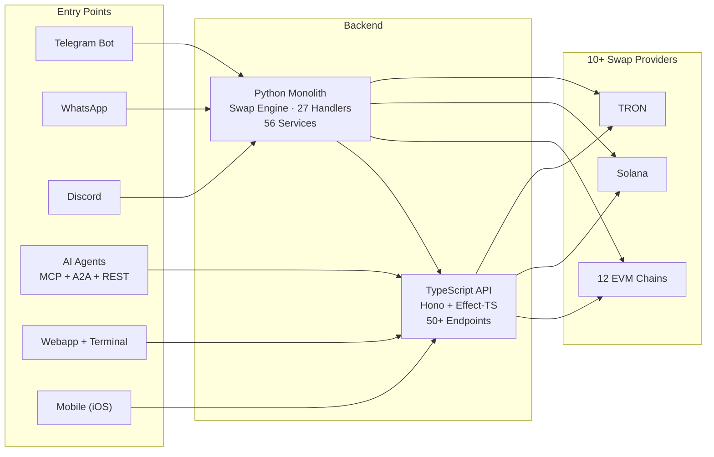

# Suwappu 🌸

Cross-chain DEX infrastructure for humans and AI agents — swap tokens across 14 chains via Telegram, WhatsApp, Discord, or programmatic API.

[](docs/features/agent_integration.md)
[](https://clawhub.ai/0xsoftboi/suwappu-dex)
[](api-ts/agent-card.json)
[]()
[]()

## Overview

**14 chains. 10+ swap providers. 3 agent protocols. 4 frontends.**

| | |
|---|---|
| **Chains** | 12 EVM (ETH, BSC, Polygon, Arbitrum, Optimism, Base, Avalanche, Fantom, Linea, Mantle, Gnosis, Scroll) + Solana + TRON |
| **Swap Providers** | CoW Protocol, Socket, Jupiter, Jito, Li.Fi, Circle CCTP, Across, Wormhole, LayerZero/Stargate, Chainlink CCIP |
| **Agent Protocols** | REST API (50+ endpoints) · MCP (8 tools) · A2A (JSON-RPC) |
| **Platforms** | Telegram Bot · WhatsApp · Discord · Web Terminal · Mobile (iOS) |
| **SDKs** | [`@suwappu/sdk`](https://www.npmjs.com/package/@suwappu/sdk) · [`@suwappu/mcp-server`](https://www.npmjs.com/package/@suwappu/mcp-server) · Python SDK |

---

## Architecture



---

## Features

### Trading
- **Cross-chain swaps** — 10+ providers with priority-based routing, quote comparison, slippage protection
- **MEV protection** — CoW Protocol batch auctions (EVM) + Jito bundles (Solana)
- **Limit orders** — Buy/sell triggers, stop-loss, trailing stop with expiry
- **DCA orders** — Dollar-cost averaging on daily/weekly/monthly intervals
- **Token sniping** — Pump.fun + Raydium launch detection, instant/conditional/first-block modes
- **Perpetuals** — HyperLiquid integration (1-20x leverage, TP/SL, position monitoring)
- **Copy trading** — Follow up to 5 traders, auto-mirror swaps, PnL leaderboard

### Security
- **Anti-rug engine** — Safety scoring (0-100), honeypot detection, mint/freeze authority checks, blacklist, liquidity analysis
- **Transaction simulation** — Simulate before execution
- **Wallet encryption** — AES-256-GCM envelope encryption with AWS KMS (auto-migrates from legacy Fernet)
- **Turnkey TEE wallets** — Hardware-isolated key management with sub-org policies
- **2FA** — TOTP (Google Authenticator compatible) with configurable threshold (default $1,000+)
- **Spending limits** — Per-swap ($5K), hourly ($10K), daily ($50K) — user-customizable
- **Withdrawal whitelisting** — Pre-approved addresses with 24h cooldown

### Agent Integration

| Protocol | Endpoint | Tools/Skills |
|----------|----------|-------------|
| **REST API** | `/v1/agent/*` | 50+ endpoints — swaps, wallets, portfolio, perps, predictions, lending, webhooks |
| **MCP** | `/mcp` | 8 tools — get_quote, execute_swap, get_portfolio, get_prices, list_chains, list_tokens, get_tempo_tokens, browse_mpp_directory |
| **A2A** | `/a2a` | Natural language — "swap 0.5 ETH to USDC on base", "price ETH SOL BTC" |

**Framework toolkits:** [LangChain](https://github.com/0xSoftBoi/suwappu-langchain) · [CrewAI](https://github.com/0xSoftBoi/suwappu-crewai-crew) · **[OpenClaw](packages/openclaw/SKILL.md)** (zero-code, native MCP). Add Suwappu to any OpenClaw agent in one command:

```bash
openclaw mcp add suwappu --url https://api.suwappu.bot/mcp \
  --transport streamable-http \
  --header "Authorization=Bearer $SUWAPPU_API_KEY" --exclude execute_swap
```

See [docs/features/openclaw_integration.md](docs/features/openclaw_integration.md).

### Engagement
- **Points/XP system** — Levels (Bronze → Platinum), daily check-ins, milestones, reward store
- **3-tier referrals** — 30% fee share to referrers
- **Subscription tiers** — Free / Pro ($9.99) / Premium ($29.99) / Enterprise ($99.99) with rate limits
- **x402 micropayments** — Token-gated access protocol
- **Tax export** — CSV/JSON yearly reports with cost-basis tracking

### Multi-Platform

| Platform | Capabilities |
|----------|-------------|
| **Telegram** | Full feature set — 27 commands, Mini App, inline keyboards |
| **WhatsApp** | Swaps, orders, DCA, alerts, voice messages, conversation flows |
| **Discord** | Whale alerts, trending tokens, leaderboard, analysis forum |
| **Web Terminal** | TradingView charts, order book, 15+ panels, keyboard shortcuts |
| **Mobile (iOS)** | 49 screens, 5 tabs — swap, portfolio, copy trading, sniping, points |

---

## Quick Start

### MCP (Claude Desktop / Cursor)

Add to your Claude Desktop config:

```json
{
  "mcpServers": {
    "suwappu": {
      "url": "https://api.suwappu.bot/mcp",
      "headers": { "Authorization": "Bearer suwappu_sk_YOUR_KEY" }
    }
  }
}
```

Or via npm:

```bash
npm install -g @suwappu/mcp-server
SUWAPPU_API_KEY=suwappu_sk_YOUR_KEY npx @suwappu/mcp-server
```

### A2A (Agent-to-Agent)

```bash
# Discover capabilities
curl https://api.suwappu.bot/.well-known/agent.json

# Natural language swap
curl -X POST https://api.suwappu.bot/a2a \
  -H "Authorization: Bearer suwappu_sk_YOUR_KEY" \
  -H "Content-Type: application/json" \
  -d '{"jsonrpc":"2.0","id":1,"method":"message/send","params":{"message":{"role":"user","parts":[{"type":"text","text":"swap 0.5 ETH to USDC on base"}]}}}'
```

### Local Development

```bash
# TypeScript API
cd api-ts && bun install && cp .env.example .env && bun run dev

# Webapp
cd webapp && npm install && npm run dev

# Bot (Python)
python -m venv venv && source venv/bin/activate
pip install -r requirements.txt && uvicorn api.main:app --reload

# Full stack
docker-compose -f docker-compose.local.yml up
```

---

## Swap Routing

The SwapEngine orchestrates 10+ providers with priority-based routing:

```
Request → Pre-checks (spending limits, safety score, MEV config)
        → SwapEngine priority router:
           1. CoW Protocol   — Same-chain EVM, MEV-protected batch auctions
           2. Socket         — Super-aggregated cross-chain + same-chain
           3. Jupiter + Jito — Solana swaps with MEV bundle protection
           4. Circle CCTP    — Native USDC cross-chain (zero fee)
           5. Across         — Fast EVM bridges (~0.04% fee)
           6. Wormhole       — Solana ↔ EVM bridging
           7. Li.Fi          — Aggregated fallback
           8. LayerZero      — Same-token cross-chain
           9. Chainlink CCIP — Generic cross-chain
        → Points-based fee discount (up to 50%)
```

---

## Supported Chains

| Chain | ID | Native | Type | Swap Providers |
|-------|-----|--------|------|---------------|
| Ethereum | 1 | ETH | EVM | CoW, Socket, Li.Fi, Across, CCTP, CCIP, LayerZero |
| BSC | 56 | BNB | EVM | Socket, Li.Fi, Across, LayerZero |
| Polygon | 137 | MATIC | EVM | CoW, Socket, Li.Fi, Across, CCTP |
| Arbitrum | 42161 | ETH | EVM | CoW, Socket, Li.Fi, Across, CCTP, LayerZero |
| Optimism | 10 | ETH | EVM | CoW, Socket, Li.Fi, Across, CCTP, LayerZero |
| Base | 8453 | ETH | EVM | CoW, Socket, Li.Fi, Across, CCTP |
| Avalanche | 43114 | AVAX | EVM | Socket, Li.Fi, Across, CCTP |
| Fantom | 250 | FTM | EVM | Socket, Li.Fi |
| Linea | 59144 | ETH | EVM | Socket, Li.Fi |
| Mantle | 5000 | MNT | EVM | Socket, Li.Fi |
| Gnosis | 100 | xDAI | EVM | Socket, Li.Fi |
| Scroll | 534352 | ETH | EVM | Socket, Li.Fi |
| Solana | — | SOL | Solana | Jupiter, Jito, Wormhole |
| TRON | — | TRX | TRON | Li.Fi |

---

## Bot Commands

| Command | Description |
|---------|-------------|
| `/s` | Quick swap — `/s <amount> <token>` |
| `/w` | Wallet management (create/import EVM, Solana, TRON) |
| `/b` | Balances across all chains |
| `/p` | Portfolio overview with PnL |
| `/o` | Limit orders + DCA |
| `/snipe` | Token sniping (Pump.fun, Raydium) |
| `/perps` | Perpetuals (HyperLiquid, 1-20x) |
| `/traders` | Copy trading leaderboard |
| `/a` | Price alerts |
| `/hx` | Transaction history |
| `/xp` | Points, levels, rewards |
| `/checkin` | Daily check-in (streak bonus) |
| `/ref` | Referral program (30% fee share) |
| `/tax` | Tax export (CSV/JSON) |
| `/c` | Custodial deposits/withdrawals |
| `/sub` | Subscription tiers |
| `/set` | Settings (slippage, 2FA, limits, notifications) |
| `/g` | Gas tracker |
| `/f` | Favorite tokens |

---

## Project Structure

```
suwappubot/
├── api-ts/             # TypeScript API (Hono + Effect-TS + Drizzle)
│   └── src/
│       ├── routes/     # 15 route modules, 50+ endpoints
│       ├── services/   # 22 services (swap, agent, perps, lending, etc.)
│       └── middleware/  # Auth (bearer, telegram, flex, admin, internal)
├── bot/                # Python Telegram bot
│   ├── handlers/       # 27 command handlers
│   ├── services/       # 56 services (swap engine, sniping, copy, security)
│   └── config/         # Chain configs, token configs, settings
├── api/                # Python FastAPI (webhook handlers)
├── webapp/             # Telegram Mini App (React + Vite) — 18 pages, 95+ components
├── terminal/           # Web Trading Terminal — 15+ panels, TradingView charts
├── showcase/           # Marketing site (Next.js + GSAP + Three.js)
├── mobile/             # iOS/Android app (Expo) — 49 screens
├── packages/
│   ├── shared/         # Shared TypeScript types (10 modules)
│   ├── sdk/            # @suwappu/sdk (npm, published)
│   ├── mcp-server/     # @suwappu/mcp-server (npm, published)
│   ├── openclaw/       # @suwappu/openclaw (npm, published)
│   └── sdk-python/     # Python SDK (development)
├── examples/           # Working examples (swap-agent, perps-trader, yield-farmer, prediction-bot)
├── gitbook/            # API documentation (33 files)
├── infra/              # AWS CDK infrastructure
├── database/           # DB init + runtime migrations
├── cpp/                # C++ core (crypto, math, validation)
├── tui/                # Terminal monitoring dashboard (Ink)
├── docs/               # Architecture docs
├── tests/              # Python tests
└── .github/workflows/  # CI/CD (4 deploy + CI + rollback)
```

---

## API Endpoints (TypeScript)

| Route Module | Auth | Key Endpoints |
|-------------|------|--------------|
| **Agent** (`/v1/agent/*`) | Bearer | register, quote, swap, execute, portfolio, prices, tokens, wallets, wallet policies, webhooks, key rotation |
| **Perps** (`/v1/agent/perps/*`) | Bearer | markets, quote, positions |
| **Predictions** (`/v1/agent/predict/*`) | Bearer | markets, market details (Polymarket) |
| **Lending** (`/v1/agent/lend/*`) | Bearer | markets, market details (Morpho) |
| **MCP** (`/mcp`) | Bearer | 8 tools via JSON-RPC |
| **A2A** (`/a2a`) | Bearer | message/send, tasks/get, tasks/cancel |
| **Webapp Swap** (`/webapp/swap/*`) | Telegram | quote, execute, status, chains, tokens |
| **Webapp Auth** (`/webapp/*`) | Various | validate, telegram auth, Turnkey OAuth, trending, token info/chart |
| **Public** (`/public/swap/*`) | Optional | chains, tokens, quote, execute, status (rate-limited) |
| **Admin** (`/admin/*`) | Admin key | stats, agents, swaps, webhooks |
| **Internal** (`/internal/*`) | Internal key | Service-to-service swap, user, events, payment verification |
| **Health** (`/health`) | None | Health + DB connectivity |

---

## npm Packages

| Package | Version | Description |
|---------|---------|-------------|
| [`@suwappu/sdk`](https://www.npmjs.com/package/@suwappu/sdk) | 0.3.0 | TypeScript SDK + `suwappu` CLI |
| [`@suwappu/mcp-server`](https://www.npmjs.com/package/@suwappu/mcp-server) | 0.5.0 | MCP server for Claude Desktop/Cursor |
| [`@suwappu/openclaw`](https://www.npmjs.com/package/@suwappu/openclaw) | 0.2.0 | OpenClaw skill module |

---

## Deployment

All services on AWS ECS Fargate (us-east-1) with circuit breaker + rollback.

| Environment | API | Webapp | Bot | Showcase | Branch |
|-------------|-----|--------|-----|----------|--------|
| **Production** | api.suwappu.bot | app.suwappu.bot | bot.suwappu.bot | www.suwappu.bot | `main` |
| **Development** | devapi.suwappu.bot | devfront.suwappu.bot | devbot.suwappu.bot | — | `dev` |

CI/CD: Push to `main`/`dev` → Docker build → Trivy scan → ECR push → DB backup → ECS deploy → health check.

---

## Security

- **Wallet encryption** — AES-256-GCM envelope encryption with AWS KMS
- **Turnkey TEE** — Hardware-isolated key management
- **2FA** — TOTP with backup codes, configurable threshold
- **Spending limits** — Per-swap, hourly, daily (user-customizable)
- **Anti-rug** — Safety scoring, honeypot detection, authority checks, emergency auto-sell
- **Token analysis** — GoPlus Security API integration
- **Transaction simulation** — Simulate before executing
- **Withdrawal whitelisting** — 24h cooldown for new addresses
- **WAF** — AWS WAF with rate limiting (300 req/IP)
- **Audit logging** — All security-sensitive actions logged

Report vulnerabilities to **security@suwappu.bot** — see [SECURITY.md](./SECURITY.md).

### Supply chain

We practice continuous open-source dependency scanning and ship a
checked-in Software Bill of Materials (SBOM).

- **Checked-in SBOM.** A [CycloneDX](https://cyclonedx.org/) SBOM lives
  at [`sbom/suwappubot.cdx.json`](./sbom/suwappubot.cdx.json) —
  every dependency across every ecosystem in this monorepo (Python,
  npm, bun), deduplicated. Generated with
  [Syft](https://github.com/anchore/syft), which auto-detects every
  package manifest/lockfile in the tree; nothing is hand-authored.

  Regenerate the SBOM:

  ```sh
  curl -sSfL https://raw.githubusercontent.com/anchore/syft/main/install.sh | sh -s -- -b /usr/local/bin
  syft . -o cyclonedx-json=sbom/suwappubot.cdx.json
  ```

- **CI workflows (SHA-pinned).** Two additive workflows live under
  `.github/workflows/`:
  - [`sbom.yml`](./.github/workflows/sbom.yml) — on each published
    Release, regenerates the CycloneDX SBOM with Syft and attaches it
    as a Release asset.
  - [`scorecard.yml`](./.github/workflows/scorecard.yml) — weekly +
    on push to `main`, runs [OpenSSF Scorecard](https://securityscorecards.dev/)
    and uploads SARIF to the repo Security tab.

  Both workflows pin every action to a full commit SHA (a stricter
  convention than this repo's other workflows, deliberately — a
  supply-chain-security workflow pinning its own dependencies loosely
  would undercut the point). This repo's Actions billing is active, so
  both run for real starting with the first push/release after merge —
  not dormant pending billing, unlike the initial rollout on other
  Suwappu satellite repos.

  Not audited, not SOC 2 — this is dependency-inventory tooling
  (what's in the tree and how it's fetched), not a security
  certification. See [SECURITY.md](./SECURITY.md) for the actual
  security posture and vulnerability-reporting process.

---

## Documentation

| Resource | Description |
|----------|-------------|
| [GitBook API Docs](gitbook/) | Full API reference (33 files) |
| [Agent Integration](docs/features/agent_integration.md) | MCP, A2A, REST setup |
| [Examples](examples/) | Working examples: swap-agent, perps-trader, yield-farmer, prediction-bot |
| [Deployment](docs/deployment/) | AWS, CI/CD, releases |
| [Development](docs/development/) | Local setup, debugging, migrations |

---

## Links

- **Webapp:** https://app.suwappu.bot
- **API:** https://api.suwappu.bot
- **Showcase:** https://www.suwappu.bot
- **Telegram Bot:** [@SuwappuBot](https://t.me/SuwappuBot)
- **Agent Card:** https://api.suwappu.bot/.well-known/agent.json
