# Suwappu Sprint Plan: Mock → Real Data

## Current State Analysis

### ✅ Working (Real API)
| Feature | Frontend | API Endpoint | Status |
|---------|----------|--------------|--------|
| Auth | `useAuth` | `POST /webapp/telegram/auth` | ✅ |
| Portfolio | `usePortfolio` | `GET /webapp/portfolio` | ✅ |
| Swap History | `useSwapHistory` | `GET /webapp/swaps` | ✅ |
| Passkeys | `usePasskey` | `POST /webapp/passkey/*` | ✅ |

### 🔴 Mock/Hardcoded (Needs Work)

| Page | Mock Data | Needs |
|------|-----------|-------|
| **Swap.tsx** | Token list, prices, execution | Quote API, Execute API |
| **Wallet.tsx** | Balances, addresses, chains | Wallet API, Balance API |
| **Settings.tsx** | Slippage, alerts, preferences | Settings API |
| **Portfolio.tsx** | Token details | Token metadata API |

---

## Parallelizable Work Streams

```mermaid
flowchart TB
    subgraph Stream1["🔵 Stream 1: Swap Flow"]
        S1A["API: GET /webapp/swap/quote"]
        S1B["API: POST /webapp/swap/execute"]
        S1C["Frontend: Token Selector"]
        S1D["Frontend: Quote Display"]
        S1E["Frontend: Tx Status"]
        S1A --> S1C --> S1D
        S1B --> S1E
    end

    subgraph Stream2["🟢 Stream 2: Wallet & Balances"]
        S2A["API: GET /webapp/wallets"]
        S2B["API: GET /webapp/balances"]
        S2C["Frontend: Wallet List"]
        S2D["Frontend: Balance Display"]
        S2E["Frontend: Send/Receive"]
        S2A --> S2C
        S2B --> S2D
        S2C --> S2E
    end

    subgraph Stream3["🟡 Stream 3: Settings & Preferences"]
        S3A["API: GET/PUT /webapp/settings"]
        S3B["DB: Settings Schema"]
        S3C["Frontend: Settings Form"]
        S3B --> S3A --> S3C
    end

    subgraph Stream4["🟣 Stream 4: Token Data"]
        S4A["API: GET /tokens/list"]
        S4B["API: GET /tokens/{id}/price"]
        S4C["Service: Price Aggregation"]
        S4D["Frontend: Token Search"]
        S4C --> S4A & S4B --> S4D
    end
```



---

## GitHub Issues

### Stream 1: Swap Flow 🔵

#### Issue #1: Swap Quote API
**Labels:** `api`, `priority:high`
```markdown
## Description
Implement swap quote endpoint that returns pricing from Li.Fi/Jupiter.

## Acceptance Criteria
- [ ] `GET /webapp/swap/quote?from=ETH&to=USDC&amount=1&fromChain=1&toChain=137`
- [ ] Returns: rate, fees, estimated gas, route info
- [ ] Caches quotes for 30s
- [ ] Error handling for unsupported pairs

## Files
- `api-ts/src/routes/swap.ts`
- `api-ts/src/services/SwapService.ts`
```

#### Issue #2: Swap Execute API
**Labels:** `api`, `priority:high`
```markdown
## Description
Execute swap via Li.Fi/Jupiter with user's Turnkey wallet.

## Acceptance Criteria
- [ ] `POST /webapp/swap/execute` with quote ID
- [ ] Signs tx with Turnkey
- [ ] Returns tx hash immediately
- [ ] Webhook/polling for status updates

## Files
- `api-ts/src/routes/swap.ts`
- `api-ts/src/services/SwapService.ts`
- `api-ts/src/services/TurnkeyService.ts`
```

#### Issue #3: Frontend Token Selector
**Labels:** `frontend`, `priority:high`
```markdown
## Description
Replace hardcoded token list with API-driven selector.

## Acceptance Criteria
- [ ] Fetch tokens from `/tokens/list`
- [ ] Search/filter by name/symbol
- [ ] Show balances for owned tokens
- [ ] Chain filter

## Files
- `webapp/src/components/swap/TokenSelector.tsx`
- `webapp/src/hooks/useTokens.ts`
```

#### Issue #4: Frontend Swap Integration
**Labels:** `frontend`, `priority:high`
```markdown
## Description
Wire Swap.tsx to real quote/execute APIs.

## Acceptance Criteria
- [ ] Call quote API on amount change (debounced)
- [ ] Display real rates, fees, route
- [ ] Execute via API on confirm
- [ ] Poll for tx status
- [ ] Error handling

## Files
- `webapp/src/pages/Swap.tsx`
- `webapp/src/hooks/useSwapQuote.ts`
- `webapp/src/hooks/useSwapExecute.ts`
```

---

### Stream 2: Wallet & Balances 🟢

#### Issue #5: Wallets API
**Labels:** `api`, `priority:high`
```markdown
## Description
API endpoints for wallet management.

## Acceptance Criteria
- [ ] `GET /webapp/wallets` - list user wallets
- [ ] `POST /webapp/wallets` - add external wallet
- [ ] `DELETE /webapp/wallets/:id` - remove wallet
- [ ] Include chain info per wallet

## Files
- `api-ts/src/routes/wallets.ts`
- `api-ts/src/services/WalletService.ts`
```

#### Issue #6: Balances API
**Labels:** `api`, `priority:high`
```markdown
## Description
Fetch real balances across chains for user wallets.

## Acceptance Criteria
- [ ] `GET /webapp/balances` - all balances
- [ ] `GET /webapp/balances?chain=ethereum` - filter by chain
- [ ] Use Alchemy/RPC for EVM, Helius for Solana
- [ ] Cache for 60s

## Files
- `api-ts/src/routes/balances.ts`
- `api-ts/src/services/BalanceService.ts`
```

#### Issue #7: Frontend Wallet Page
**Labels:** `frontend`, `priority:high`
```markdown
## Description
Replace mock data in Wallet.tsx with real APIs.

## Acceptance Criteria
- [ ] Fetch wallets from API
- [ ] Fetch balances per wallet
- [ ] Real QR code for receive
- [ ] Send flow with tx signing

## Files
- `webapp/src/pages/Wallet.tsx`
- `webapp/src/hooks/useWallets.ts`
- `webapp/src/hooks/useBalances.ts`
```

---

### Stream 3: Settings 🟡

#### Issue #8: Settings API + Schema
**Labels:** `api`, `db`, `priority:medium`
```markdown
## Description
Persist user settings to database.

## Acceptance Criteria
- [ ] DB schema for user_settings
- [ ] `GET /webapp/settings`
- [ ] `PUT /webapp/settings`
- [ ] Fields: slippage, notifications, theme

## Files
- `api-ts/src/db/schema/settings.ts`
- `api-ts/src/routes/settings.ts`
- `api-ts/src/services/SettingsService.ts`
```

#### Issue #9: Frontend Settings
**Labels:** `frontend`, `priority:medium`
```markdown
## Description
Wire Settings.tsx to real API.

## Acceptance Criteria
- [ ] Load settings on mount
- [ ] Save on change (debounced)
- [ ] Optimistic updates
- [ ] Toast on save

## Files
- `webapp/src/pages/Settings.tsx`
- `webapp/src/hooks/useSettings.ts`
```

---

### Stream 4: Token Data 🟣

#### Issue #10: Token List API
**Labels:** `api`, `priority:medium`
```markdown
## Description
Searchable token list with metadata.

## Acceptance Criteria
- [ ] `GET /tokens?search=&chain=&limit=`
- [ ] Include: symbol, name, address, decimals, logo
- [ ] Popular tokens first
- [ ] Support all 7 chains

## Files
- `api-ts/src/routes/tokens.ts`
- `api-ts/src/services/TokenService.ts`
```

#### Issue #11: Token Prices API
**Labels:** `api`, `priority:medium`
```markdown
## Description
Real-time token prices.

## Acceptance Criteria
- [ ] `GET /tokens/prices?ids=eth,usdc,sol`
- [ ] Aggregate from CoinGecko/DeFiLlama
- [ ] Cache for 60s
- [ ] Include 24h change

## Files
- `api-ts/src/routes/tokens.ts`
- `api-ts/src/services/PriceService.ts`
```

---

## Agent Assignment

| Agent | Stream | Issues | Est. Time |
|-------|--------|--------|-----------|
| **Agent 1** | Swap API | #1, #2 | 2-3h |
| **Agent 2** | Swap Frontend | #3, #4 | 2-3h |
| **Agent 3** | Wallet/Balances | #5, #6, #7 | 3-4h |
| **Agent 4** | Settings + Tokens | #8, #9, #10, #11 | 3-4h |

---

## Execution Order

```mermaid
gantt
    title Sprint Timeline
    dateFormat HH:mm
    axisFormat %H:%M
    
    section Stream 1
    Quote API       :a1, 00:00, 1h
    Execute API     :a2, after a1, 1h
    Token Selector  :a3, 00:00, 1h
    Swap Integration:a4, after a1, 2h
    
    section Stream 2
    Wallets API     :b1, 00:00, 1h
    Balances API    :b2, 00:00, 1h
    Wallet Frontend :b3, after b1, 2h
    
    section Stream 3
    Settings Schema :c1, 00:00, 30m
    Settings API    :c2, after c1, 1h
    Settings Frontend:c3, after c2, 1h
    
    section Stream 4
    Token List API  :d1, 00:00, 1h
    Prices API      :d2, after d1, 1h
```



---

## How to Run

### Create Issues
```bash
# From repo root
gh issue create --title "Swap Quote API" --body-file .github/ISSUE_TEMPLATE/api.md --label "api,priority:high"
```

### Spawn Agents
```
/spawn agent1 "Work on Issue #1 and #2 (Swap APIs) in api-ts/"
/spawn agent2 "Work on Issue #3 and #4 (Swap Frontend) in webapp/"
/spawn agent3 "Work on Issues #5-7 (Wallet/Balances) in api-ts/ and webapp/"
/spawn agent4 "Work on Issues #8-11 (Settings + Tokens)"
```

### Git Worktrees (for isolation)
```bash
git worktree add ../suwappu-swap-api feature/swap-api
git worktree add ../suwappu-swap-ui feature/swap-ui
git worktree add ../suwappu-wallet feature/wallet-balances
git worktree add ../suwappu-settings feature/settings-tokens
```

---

## Definition of Done

- [ ] All mock data replaced with API calls
- [ ] Loading states for all async operations
- [ ] Error handling with user feedback
- [ ] TypeScript types match API responses
- [ ] Works in Telegram Mini App
- [ ] No console errors
