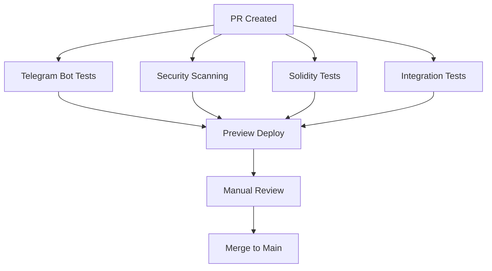

# 🚀 GitHub Actions Workflows Documentation

This document provides comprehensive documentation for all GitHub Actions workflows configured for the Suwappu project.

## 📋 Table of Contents

1. [Telegram Bot Testing Framework](#telegram-bot-testing-framework)
2. [Smart Contract Security Scanning](#smart-contract-security-scanning)
3. [Solidity Testing & Coverage](#solidity-testing--coverage)
4. [PR Preview Deployments](#pr-preview-deployments)
5. [Integration Testing Pipeline](#integration-testing-pipeline)
6. [Configuration & Secrets](#configuration--secrets)

---

## 🤖 Telegram Bot Testing Framework

**File:** `.github/workflows/telegram-bot-tests.yml`

### Purpose
Automated testing framework for the Telegram bot with comprehensive logging and coverage reporting.

### Triggers
- Pull requests to `main` or `develop` branches (when bot code changes)
- Pushes to `main` or `develop` branches (when bot code changes)

### Features
- ✅ Multi-version Python testing (3.10, 3.11, 3.12)
- ✅ Automated test logging with configurable log levels
- ✅ Code coverage reporting with HTML and XML output
- ✅ Integration test support
- ✅ Health check validation
- ✅ PR comments with test results
- ✅ Test artifacts with 14-day retention

### Required Secrets
- `TEST_TELEGRAM_BOT_TOKEN` (optional) - Test bot token for integration tests

### Artifacts Generated
- `test-logs-{version}` - Detailed test execution logs
- `coverage-report` - Code coverage reports
- `test-results-{version}` - JUnit XML test results
- `health-check-report` - Bot health check results

---

## 🔒 Smart Contract Security Scanning

**File:** `.github/workflows/smart-contract-security.yml`

### Purpose
Comprehensive security analysis of Solidity smart contracts using multiple industry-standard tools.

### Triggers
- Pull requests affecting Solidity files
- Pushes to `main` or `develop` with contract changes
- Daily scheduled scans at 2 AM UTC

### Security Tools Integrated

#### 1. Slither
- Static analysis for Solidity
- Detects vulnerabilities and code quality issues
- Generates SARIF format for GitHub Security tab
- Outputs markdown reports

#### 2. Mythril
- Symbolic execution and security analysis
- Deep analysis with configurable depth
- 5-minute timeout per contract
- Markdown output format

#### 3. Securify
- Automated security analysis
- Pattern-based vulnerability detection
- Complements Slither and Mythril

### Features
- ✅ Multi-tool comprehensive scanning
- ✅ SARIF report upload to GitHub Security
- ✅ Combined security report generation
- ✅ PR comments with security findings
- ✅ Critical issue detection and alerts
- ✅ 90-day artifact retention

### Artifacts Generated
- `slither-analysis` - Slither security reports
- `mythril-analysis` - Mythril analysis results
- `securify-analysis` - Securify scan results
- `combined-security-report` - Unified security summary

### Security Report Format
Reports include:
- High/Medium/Low severity issues
- Line-by-line vulnerability details
- Remediation suggestions
- False positive indicators

---

## 🧪 Solidity Testing & Coverage

**File:** `.github/workflows/solidity-tests.yml`

### Purpose
Automated testing for Solidity smart contracts with coverage metrics using both Hardhat and Foundry.

### Triggers
- Pull requests affecting Solidity files or tests
- Pushes to `main` or `develop` with contract changes

### Testing Frameworks

#### Hardhat Tests
- Full test suite execution
- Gas reporting enabled
- Coverage with solidity-coverage
- Contract size analysis

#### Foundry Tests
- Fast, modern Solidity testing
- Built-in fuzzing capabilities
- Detailed gas reports
- LCOV coverage format

### Features
- ✅ Dual testing framework support (Hardhat + Foundry)
- ✅ Code coverage with Codecov integration
- ✅ Gas usage analysis and reporting
- ✅ Contract size validation (24KB limit check)
- ✅ PR comments with test summaries
- ✅ Multiple artifact uploads

### Artifacts Generated
- `hardhat-coverage` - Hardhat coverage reports
- `foundry-reports` - Gas reports, coverage, summaries
- `contract-sizes` - Contract size analysis

### Coverage Metrics
- Line coverage
- Branch coverage
- Function coverage
- Statement coverage

---

## 🌐 PR Preview Deployments

**File:** `.github/workflows/pr-preview-deploy.yml`

### Purpose
Automated preview environment deployment for pull requests with comprehensive testing before merge.

### Triggers
- PR opened, synchronized, or reopened
- PR closed (triggers cleanup)

### Features
- ✅ Isolated preview environment per PR
- ✅ Custom preview URLs (e.g., pr-123-suwappu.preview.com)
- ✅ Automated deployment status tracking
- ✅ Docker-based deployment
- ✅ Smoke tests on deployed environment
- ✅ Vercel integration for webapp
- ✅ Automatic cleanup on PR close
- ✅ PR comments with deployment info

### Preview Environment Includes
- Full application stack
- Isolated database (preview_pr-{number})
- Debug logging enabled
- Health monitoring
- Quick access links

### Required Secrets
- `PREVIEW_TELEGRAM_BOT_TOKEN` - Bot token for preview
- `VERCEL_TOKEN` - Vercel deployment token
- `VERCEL_ORG_ID` - Vercel organization ID
- `VERCEL_PROJECT_ID` - Vercel project ID

### Deployment Platforms Supported
- Railway
- Render
- Fly.io
- Vercel
- Docker-based custom deployments

### Cleanup Process
When PR is closed:
1. Stops all preview services
2. Deletes preview database
3. Removes deployment
4. Comments on PR about cleanup

---

## 🔗 Integration Testing Pipeline

**File:** `.github/workflows/integration-tests.yml`

### Purpose
Comprehensive integration and end-to-end testing with service dependencies.

### Triggers
- Pull requests to `main` or `develop`
- Pushes to `main` or `develop`
- Daily scheduled runs at 3 AM UTC

### Test Types

#### 1. Bot Integration Tests
- Full bot workflow testing
- Database integration
- Redis cache testing
- API interactions

#### 2. API Integration Tests
- REST API endpoint testing
- TypeScript API tests
- Database operations

#### 3. End-to-End Tests
- Playwright-based browser tests
- Full user journey testing
- Cross-component validation

#### 4. Performance Tests
- Load testing with Locust
- Performance benchmarks with pytest-benchmark
- Response time analysis

### Service Dependencies
- PostgreSQL 15
- Redis 7
- Full application stack

### Features
- ✅ Service health checks
- ✅ Database migrations testing
- ✅ Multi-service orchestration
- ✅ Performance benchmarking
- ✅ E2E test reports with screenshots
- ✅ Comprehensive test summary
- ✅ PR comments with results

### Artifacts Generated
- `integration-test-results` - Integration test outputs
- `e2e-test-results` - Playwright reports and screenshots
- `performance-results` - Benchmark JSON results
- `integration-summary` - Consolidated test summary

---

## ⚙️ Configuration & Secrets

### Required GitHub Secrets

#### Testing
```
TEST_TELEGRAM_BOT_TOKEN - Telegram bot token for testing
PREVIEW_TELEGRAM_BOT_TOKEN - Bot token for preview environments
```

#### Deployment
```
VERCEL_TOKEN - Vercel deployment authentication
VERCEL_ORG_ID - Vercel organization identifier
VERCEL_PROJECT_ID - Vercel project identifier
```

#### Security (Optional)
```
CODECOV_TOKEN - Codecov upload token (optional but recommended)
```

### Environment Variables

All workflows use consistent environment variables:
```yaml
PYTHON_VERSION: '3.11'
NODE_VERSION: '20'
LOG_LEVEL: DEBUG (in test/preview environments)
DATABASE_URL: Auto-configured per environment
```

### Artifact Retention Policies

| Artifact Type | Retention Period | Purpose |
|---------------|------------------|---------|
| Test Logs | 14 days | Debugging test failures |
| Coverage Reports | 14-30 days | Coverage tracking |
| Security Reports | 90 days | Long-term security auditing |
| Performance Results | 30 days | Performance regression detection |
| Preview Artifacts | 7 days | Temporary preview validation |

---

## 🔧 Customization Guide

### Adding New Tests

1. **Unit Tests**: Add to `tests/` directory
2. **Integration Tests**: Add to `tests/integration/`
3. **E2E Tests**: Add to `tests/e2e/`
4. **Performance Tests**: Add to `tests/performance/`

### Modifying Triggers

Edit the `on:` section in workflow files:
```yaml
on:
  pull_request:
    branches: [main, develop, feature/*]
    paths:
      - 'specific/path/**'
```

### Adjusting Test Coverage Requirements

Modify coverage thresholds in workflow steps or add to `pytest.ini`:
```ini
[pytest]
addopts = --cov --cov-fail-under=80
```

### Adding New Security Scanners

Add new job to `smart-contract-security.yml`:
```yaml
  new-scanner:
    runs-on: ubuntu-latest
    steps:
      - name: Run New Scanner
        run: scanner analyze contracts/
```

---

## 📊 Monitoring & Alerts

### GitHub Actions Dashboard
Monitor workflow runs at:
`https://github.com/0xSoftBoi/suwappubot/actions`

### Success Indicators
- ✅ All checks passing
- 📊 Coverage reports generated
- 🔒 No critical security issues
- 🚀 Preview deployed successfully

### Failure Response

1. **Check workflow logs**
2. **Download relevant artifacts**
3. **Review PR comments for details**
4. **Re-run failed jobs if transient**

---

## 🎯 Best Practices

### For Contributors

1. **Wait for all checks** before requesting review
2. **Review security scan results** in PR comments
3. **Check coverage changes** - maintain or improve coverage
4. **Test in preview environment** before approving
5. **Address all security findings** before merge

### For Maintainers

1. **Monitor scheduled scans** for new vulnerabilities
2. **Review artifact retention** and cleanup periodically
3. **Update dependencies** in workflows regularly
4. **Rotate secrets** quarterly
5. **Document workflow changes** in this file

---

## 🆘 Troubleshooting

### Common Issues

#### Tests Failing in CI but Pass Locally
- Check Python/Node version differences
- Verify environment variables are set
- Review service dependencies

#### Security Scans Too Slow
- Adjust `max-depth` in Mythril
- Limit files being scanned
- Use scheduled scans instead of PR triggers

#### Preview Deployment Failures
- Verify deployment platform secrets
- Check resource limits
- Review deployment logs in artifacts

#### Coverage Report Not Generated
- Ensure pytest-cov is installed
- Check test execution completed
- Verify coverage file paths

---

## 📚 Additional Resources

- [GitHub Actions Documentation](https://docs.github.com/en/actions)
- [Slither Documentation](https://github.com/crytic/slither)
- [Mythril Documentation](https://github.com/ConsenSys/mythril)
- [Foundry Book](https://book.getfoundry.sh/)
- [Hardhat Documentation](https://hardhat.org/docs)
- [Playwright Documentation](https://playwright.dev/)

---

## 🔄 Workflow Dependencies



---

**Last Updated:** 2026-02-25  
**Maintained by:** Suwappu Development Team  
**Questions?** Open an issue or contact the maintainers.
