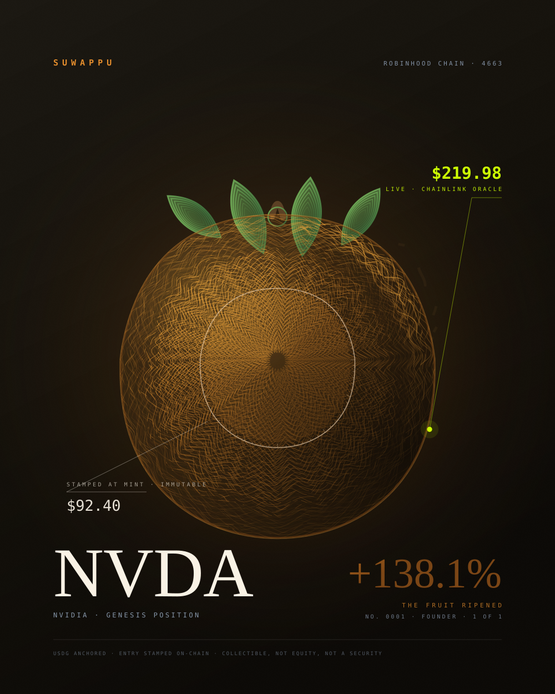

# Genesis Persimmon — Position No. 0001

A 1/1. The Suwappu mark, engine-turned, on Robinhood Chain.



## The idea

The collection's whole thesis is one sentence: *your entry price is stamped
on-chain forever, and the card shows what happened since.* This piece makes
that literal instead of decorative — **the fruit ripened.**

- The **silhouette is the Suwappu mark itself.** The persimmon body from
  `suwappu.bot/favicon.svg` is parsed out of its four cubic béziers, resampled
  into a radial profile `r(θ)`, and every guilloché ring is that profile. The
  form is not "logo-like"; it is the logo, turned on a lathe.
- The **ring struck true at 42% of the extent is the entry price** — 92.40 of
  219.98 is exactly 0.420. Inside it the weave is machined, quiet, sealed:
  that is the past, and it cannot be edited. Everything outside it is growth
  since — the weave loosens, a directional gale takes it, threads duck under
  the lattice and fray into free filaments at the ripening shore.
- The **one acid-lime mark is the live Chainlink oracle**, and it is the only
  saturated thing on the plate, because it is the only number still moving.

## Provenance of every colour and face

Nothing here was invented or remembered. Both palettes were read from the
live products on 2026-08-17:

| Source | Read from | Used for |
|---|---|---|
| `--sw-accent` `#e58d2b`, bright `#f6a93c`, deep `#c9731d`, dark `#7a4413` | CSS served by www.suwappu.bot | the fruit |
| leaf `#7ab85b` → `#2f5e34`, body `#ffb45b`/`#f1662d`/`#b53b17` | suwappu.bot `favicon.svg` | calyx, flesh gradient |
| `--sw-cream` `#faf3e6`, `--sw-cosmic-muted` `#93a5bc` | CSS served by www.suwappu.bot | stamp, small type |
| EB Garamond · JetBrains Mono | the faces suwappu.bot actually loads | display · data |
| `#110e08` warm near-black (their most-used value) | CSS served by docs.robinhood.com/chain | the ground |
| `#ccff00` brand acid lime | CSS served by docs.robinhood.com/chain | the live oracle mark |

The position is real repo data: NVDA, chain 4663, Chainlink-fed, USDG-anchored,
entry $92.40 → $219.98, +138.1%, mint rank 1.

> The earlier "Centurion Noir" direction (black + gold, Amex lineage) is
> abandoned here. It was a good card for *a* company; the persimmon on warm
> near-black is this one — and it happens that Suwappu's amber and Robinhood
> Chain's warm black are the same temperature, which is why they sit together.

## Run

```bash
python3 art/genesis-persimmon/genesis.py   # -> genesis-persimmon.svg
```

Deterministic: same seed, same plate, byte for byte. No external references —
no remote fonts, images or stylesheets — so it survives a marketplace CSP.
