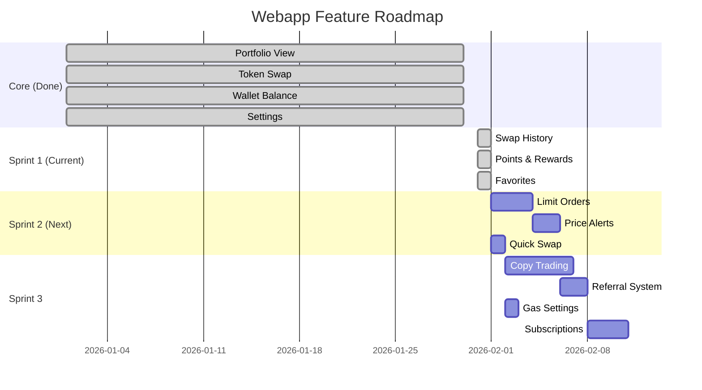
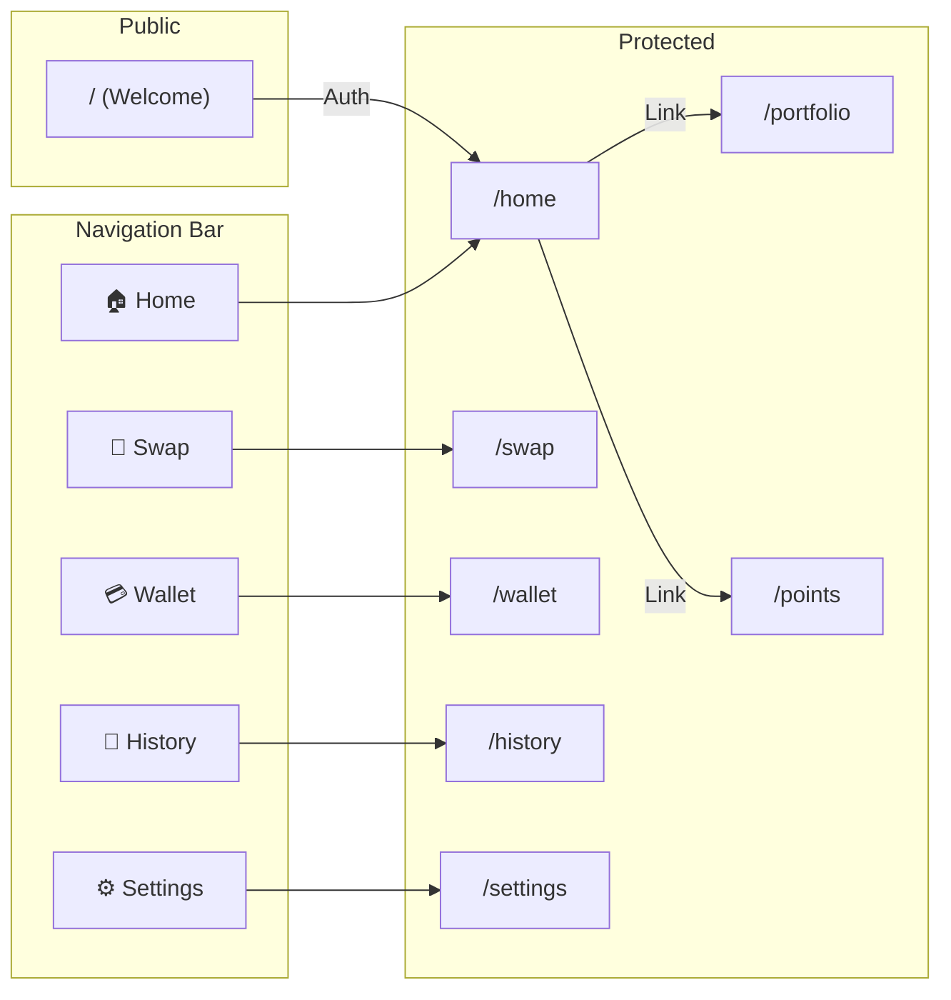
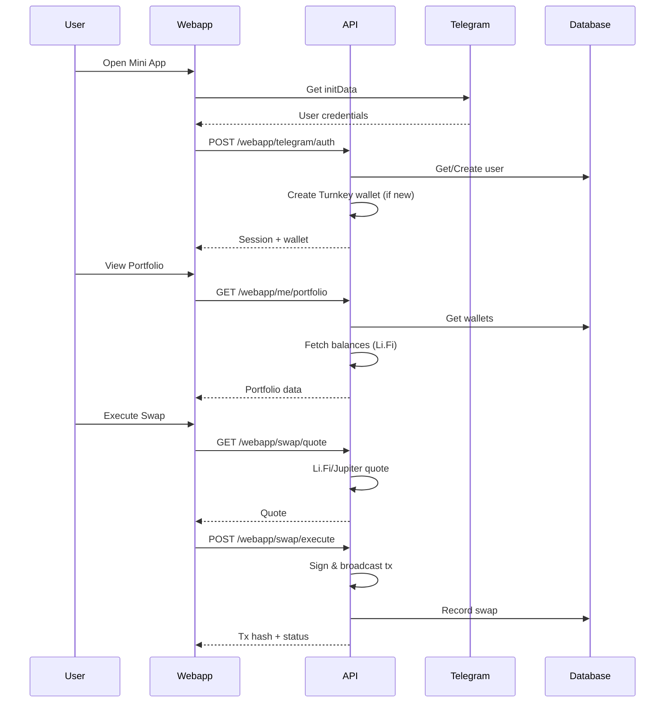
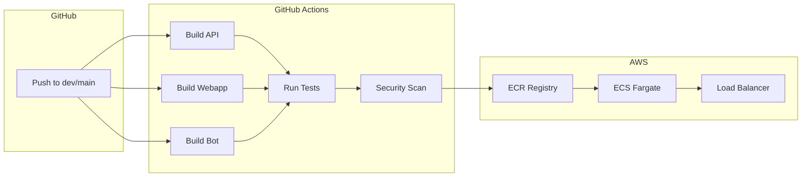

# Suwappu Webapp Features

## Architecture Overview

```mermaid
graph TB
    subgraph "Frontend (React)"
        W[Webapp<br/>React + Vite]
        
        subgraph "Pages"
            P1[Welcome]
            P2[Home]
            P3[Swap]
            P4[Wallet]
            P5[Portfolio]
            P6[History]
            P7[Points]
            P8[Settings]
        end
        
        subgraph "Hooks"
            H1[usePortfolio]
            H2[useSwapHistory]
            H3[useSwapQuote]
            H4[useFavorites]
            H5[useWallet]
            H6[useTelegram]
        end
    end
    
    subgraph "Backend (Hono + Effect)"
        API[API-TS<br/>Bun + Hono]
        
        subgraph "Routes"
            R1[/webapp/*]
            R2[/agent/*]
            R3[/a2a/*]
            R4[/health]
        end
        
        subgraph "Services"
            S1[UserService]
            S2[WalletService]
            S3[SwapService]
            S4[PointsService]
            S5[BalanceService]
            S6[TurnkeyService]
        end
    end
    
    subgraph "External"
        TG[Telegram<br/>Mini App]
        LF[Li.Fi API]
        JUP[Jupiter API]
        TK[Turnkey<br/>Wallets]
        RDS[(PostgreSQL<br/>RDS)]
    end
    
    W --> API
    W --> TG
    API --> LF
    API --> JUP
    API --> TK
    API --> RDS
    
    P1 --> H6
    P2 --> H1
    P3 --> H3
    P4 --> H5
    P5 --> H1
    P6 --> H2
    P7 --> API
    P8 --> API
```

## Feature Implementation Plan



## Feature Status

| # | Feature | Frontend | API | Bot | Status |
|---|---------|----------|-----|-----|--------|
| 1 | Portfolio View | ✅ | ✅ | ✅ | 🟢 Complete |
| 2 | Token Swap | ✅ | ✅ | ✅ | 🟢 Complete |
| 3 | Swap History | ✅ | ✅ | ✅ | 🟢 Complete |
| 4 | Wallet Balance | ✅ | ✅ | ✅ | 🟢 Complete |
| 5 | Settings | ✅ | ✅ | ✅ | 🟢 Complete |
| 6 | Points & Rewards | ✅ | ✅ | ✅ | 🟢 Complete |
| 7 | Favorites | ✅ | ❌ | ✅ | 🟡 Frontend only |
| 8 | Limit Orders | ❌ | ❌ | ✅ | 🔴 Todo |
| 9 | Price Alerts | ❌ | ❌ | ✅ | 🔴 Todo |
| 10 | Quick Swap | ❌ | ❌ | ✅ | 🔴 Todo |
| 11 | Copy Trading | ❌ | ❌ | ✅ | 🔴 Todo |
| 12 | Referral System | ❌ | ❌ | ✅ | 🔴 Todo |
| 13 | Gas Settings | ❌ | ❌ | ✅ | 🔴 Todo |
| 14 | Subscriptions | ❌ | ❌ | ✅ | 🔴 Todo |

## Page Routes



## Data Flow



## Environment Setup

### Development
- **Frontend:** `devfront.suwappu.bot`
- **API:** `devapi.suwappu.bot`
- **Database:** `suwappu-db-dev` (RDS)
- **Bot:** `@SuwappuDevBot`

### Production
- **Frontend:** `app.suwappu.bot`
- **API:** `api.suwappu.bot`
- **Database:** `suwappu-db` (RDS)
- **Bot:** `@SuwappuBot`

## CI/CD Pipeline



## GitHub Issues

- [#94](https://github.com/0xSoftBoi/suwappubot/issues/94) ✅ Swap History
- [#95](https://github.com/0xSoftBoi/suwappubot/issues/95) ✅ Points & Rewards
- [#96](https://github.com/0xSoftBoi/suwappubot/issues/96) 🔴 Limit Orders
- [#97](https://github.com/0xSoftBoi/suwappubot/issues/97) 🔴 Price Alerts
- [#98](https://github.com/0xSoftBoi/suwappubot/issues/98) ✅ Favorite Tokens
- [#99](https://github.com/0xSoftBoi/suwappubot/issues/99) 🔴 Quick Swap
- [#100](https://github.com/0xSoftBoi/suwappubot/issues/100) 🔴 Copy Trading
- [#101](https://github.com/0xSoftBoi/suwappubot/issues/101) 🔴 Gas Settings
- [#102](https://github.com/0xSoftBoi/suwappubot/issues/102) 🔴 Referral System
- [#103](https://github.com/0xSoftBoi/suwappubot/issues/103) 🔴 Subscriptions
