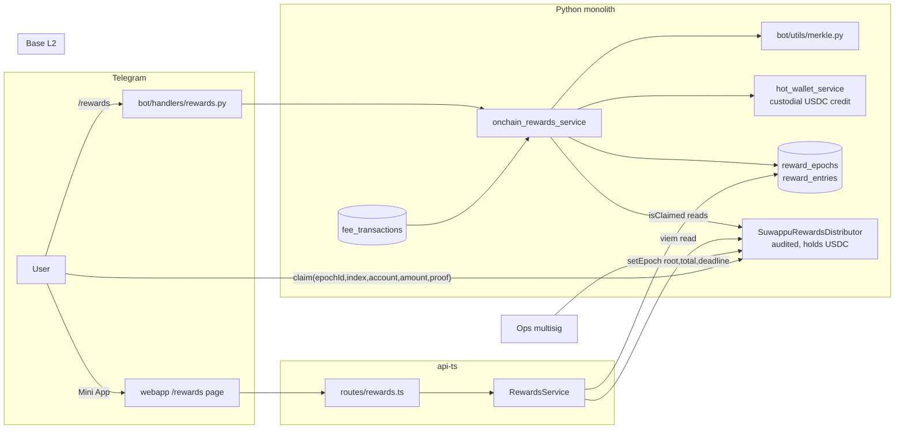
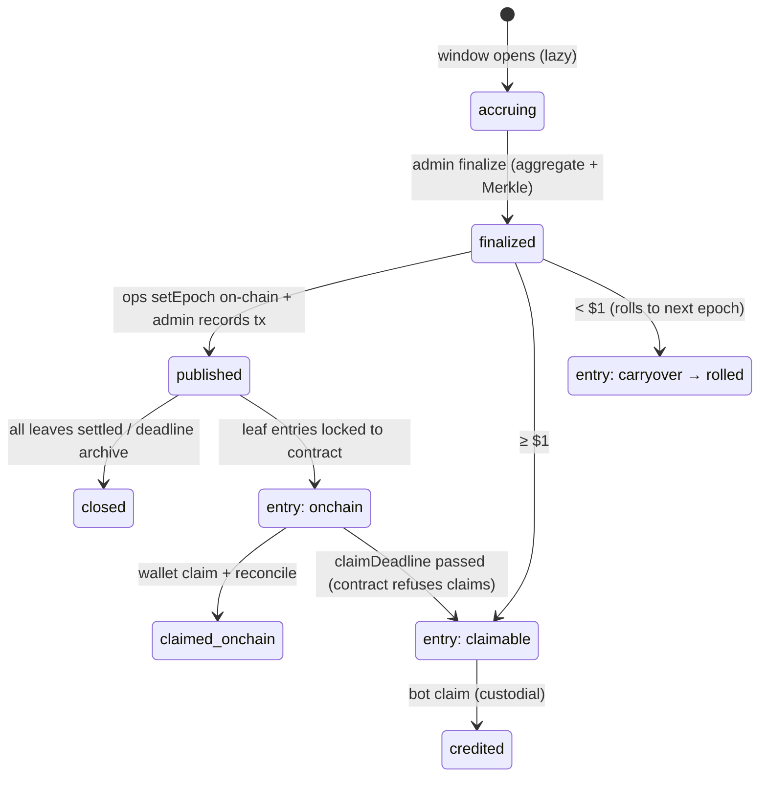

# Suwappu Rewards — On-Chain Fee Cashback (Rewards v1)

Production design for the on-chain rewards application: weekly fee-cashback epochs
settled through an **audited `SuwappuRewardsDistributor` smart contract** (trusted
external component) with a custodial-credit fallback. Implements roadmap item #8
(Referral 2.0 — auto-recurring cashback) from `docs/internal/parity/competitive-improvements.md`.

Everything in the *Shipped* column below exists on this branch and is tested; the
*Roadmap* section at the end is explicit about what is not built yet.

---

## 1. System architecture

**Product invariant:** a user earns **10% of their own paid swap fees back in USDC,
per weekly epoch**, and each epoch entry settles **exactly once** — either on-chain
via the distributor or as a custodial balance credit, never both.

**Ownership split** (matches the repo's existing service ownership):

| Concern | Owner | Why |
|---|---|---|
| Accrual, epoch finalize, Merkle build, publish bookkeeping, custodial credit, reconciliation | **Python monolith** (`bot/`) | All money writes already live here (fees, referrals, custodial balances); reuses `hot_wallet_service` + `get_session` atomicity |
| Read API for the Mini App (summary, history, wallet-claim payloads, live `isClaimed`) | **api-ts** (Hono + Effect-TS) | Serves the webapp; viem read-only client; zero write authority |
| Claim UX (custodial + on-chain) | **Telegram bot** + **webapp Mini App** | Bot = one-tap custodial credit; Mini App = wallet claim with Merkle proof |
| USDC custody + claim verification | **`SuwappuRewardsDistributor`** (audited contract, Base) | Per-epoch Merkle roots, claim deadline enforcement, double-claim bitmap |

**Trust model:** the contract is audited and treated as correct. The backend never
holds claim authority — it only *publishes roots* (ops multisig submits `setEpoch`)
and *reads* claim state. Users claim with their own wallets. The custodial fallback
can only pay an entry the contract can no longer pay (unpublished epoch, or past
`claimDeadline` — the contract reverts claims after the deadline, which is the
mechanism that makes the fallback double-pay-safe).

## 2. Component diagram



Epoch lifecycle (state machine enforced in `bot/models/onchain_rewards.py`):



## 3. Database schema

Python-owned (created idempotently by `database/db.py::_create_onchain_rewards_tables`,
mirrored type-only in `api-ts/src/db/schema/onchainRewards.ts` — never `db:push`):

**`reward_epochs`** — one row per weekly epoch
| column | type | notes |
|---|---|---|
| `epoch_index` | int UNIQUE | whole weeks since anchor (Mon 2026-01-05 UTC) |
| `starts_at` / `ends_at` | timestamp | `[anchor + i·7d, anchor + (i+1)·7d)` |
| `status` | varchar(20) | accruing → finalized → published → closed |
| `total_amount_usd`, `entry_count` | float, int | payable totals set at finalize |
| `merkle_root` | varchar(66) | 0x-hex, set at finalize |
| `published_tx_hash`, `published_at`, `claim_deadline` | | set when ops records `setEpoch` |

**`reward_entries`** — one row per (epoch, user); **UNIQUE(epoch_id, user_id)** is the
DB backstop against double-crediting an epoch
| column | type | notes |
|---|---|---|
| `cashback_usd` / `carryover_usd` / `amount_usd` | float | amount = cashback + carryover |
| `fee_basis_usd` | float | auditable: the fees the 10% was computed from |
| `claim_address` | varchar(64) | user's default active EVM wallet (NULL → custodial-only) |
| `leaf_index`, `amount_base_units`, `merkle_proof` | int, str, JSON | on-chain leaf data, stored once at finalize (single Merkle implementation, no TS/Python drift) |
| `status` | varchar(20) | claimable / carryover / rolled / onchain / claimed_onchain / credited |
| `claimed_tx_hash`, `settled_at` | | settlement audit trail |

## 4. API specification

All endpoints require Telegram `initData` auth (`telegramAuth()` middleware); every
lookup is keyed to the **authenticated** user — user ids are never accepted from the
caller.

```
GET /webapp/rewards/summary
  → 200 RewardsSummaryView {
      accruingUsd, accruingEpochIndex, accruingEndsAt,
      claimableUsd, onchainUsd, lifetimeUsd, carryoverUsd,
      cashbackRate, payoutToken, payoutChain,
      entries: [{ epochIndex, amountUsd, cashbackUsd, carryoverUsd,
                  status, claimDeadline, claimedTxHash, hasOnchainLeaf }]
    }
  → 404 user not onboarded

GET /webapp/rewards/claim/:epochIndex
  → 200 ClaimPayload {
      epochId, index, account, amount (uint256 string), merkleProof[],
      distributor, chainId (8453), claimDeadline,
      alreadyClaimed (bool | null = chain unconfigured)
    }
  → 404 no published on-chain leaf for this user+epoch
  → 400 invalid epoch index
```

Bot surface: `/rewards` (summary + claim button), callback `rewards_claim`
(custodial credit). Admin (fail-closed on `admin_telegram_ids`):
`/rewards finalize|payload|published|reconcile`.

Contract interface (audited, documented ABI in `api-ts/src/lib/rewardsDistributor.ts`
and `REWARDS_DISTRIBUTOR_ABI` in the Python service):

```solidity
function setEpoch(uint256 epochId, bytes32 merkleRoot, uint256 totalAmount, uint64 claimDeadline); // ops
function claim(uint256 epochId, uint256 index, address account, uint256 amount, bytes32[] proof);
function isClaimed(uint256 epochId, uint256 index) view returns (bool);
function token() view returns (address); // USDC
event EpochSet(uint256 indexed epochId, bytes32 merkleRoot, uint256 totalAmount, uint64 claimDeadline);
event Claimed(uint256 indexed epochId, uint256 index, address indexed account, uint256 amount);
```

Merkle convention (byte-compatible across Python builder, contract, tests):
`leaf = keccak256(abi.encodePacked(uint256 index, address account, uint256 amount))`,
sorted-pair keccak internal nodes (OpenZeppelin `MerkleProof.verify` semantics),
odd nodes promoted. Amounts always round **down** to USDC base units so the leaf sum
never exceeds the funded total.

## 5. Frontend pages

- **`webapp/src/pages/Rewards.tsx`** (`/rewards`, lazy-loaded, `ProtectedRoute`):
  gradient accruing card (live estimate + epoch countdown), claimable card (points to
  bot custodial claim), **⛓️ Claim on-chain** rows (expand → fetch proof → shows
  `claim()` args + copy-to-clipboard, `alreadyClaimed` state), carryover note,
  history list with status chips, empty state.
- **FeatureGrid** Home tile: 💸 Cashback (`New` badge).
- **Bot `/rewards`** is the equivalent surface inside Telegram chat.

## 6. Backend services

- **`bot/services/onchain_rewards_service.py`** — the money path:
  - `finalize_epoch(i)`: single-transaction aggregate of `fee_transactions` in the
    window (+ consume prior `carryover` entries → `rolled`), $1 minimum, builds the
    Merkle distribution, stores root + per-entry proofs. Once-only via the
    `accruing → finalized` status flip inside the same transaction (a crash rolls
    everything back; re-run is safe). Read-side aggregation means **no per-swap
    hooks** and natural idempotency.
  - `credit_custodial(user_id)`: flips eligible entries to `credited` first, then
    credits USDC via `hot_wallet_service.update_custodial_balance`; on failure the
    statuses are restored. A crash between the two steps under-pays (visible in
    reconciliation), never double-pays — same fail-direction as the referral claim path.
  - `mark_published` / `get_publish_payload` / `reconcile_onchain` (web3 `isClaimed`
    reads; returns newly settled entries so the handler notifies users).
- **`api-ts/src/services/RewardsService.ts`** — read-only Effect service (summary +
  claim payload + viem `isClaimed`), composed as `RewardsLayer` in `MainLayer`.

## 7. Smart contract interaction layer

- **Python (writes/bookkeeping):** ops submit `setEpoch` from a multisig — the
  backend deliberately has **no signer**. `get_publish_payload` emits the exact
  arguments; `reconcile_onchain` reads `isClaimed` via web3 (`REWARDS_DISTRIBUTOR_ADDRESS`,
  `REWARDS_RPC_URL` env).
- **api-ts (reads):** viem `createPublicClient` on Base; `readContract(isClaimed)`
  per claim payload; gracefully degrades to `alreadyClaimed: null` when the env vars
  are absent (the API still serves balances/proofs).
- **User (the only tx sender):** submits `claim()` from their own wallet with the
  payload served by the API.

## 8. State management

- **Server is the source of truth.** The entry status machine lives only in Python;
  api-ts and webapp treat statuses as read-only strings.
- **Webapp:** TanStack Query (`['rewards-summary']`, `['rewards-claim', epoch]`,
  30s staleTime); claim rows fetch proofs lazily on expand.
- **Transaction lifecycle** (on-chain claim): payload served → user submits →
  contract emits `Claimed` → `reconcile` marks `claimed_onchain` → bot notifies →
  summary/lifetime buckets update on next fetch. `alreadyClaimed` in the payload
  short-circuits double submissions in the UI.

## 9. User flows

1. **Passive accrual:** swap → fee recorded (existing path, untouched) → `/rewards`
   or Mini App shows the live 10% estimate for the current epoch.
2. **Custodial claim (default):** epoch finalized → entry `claimable` →
   `/rewards` → *Claim to balance* → USDC lands in custodial balance (`/b`).
3. **On-chain claim (published epochs):** ops publish root → entry `onchain` →
   Mini App → expand epoch → copy `claim()` args → submit from own wallet →
   reconcile confirms → Telegram notification.
4. **Missed deadline:** contract refuses late claims → entry reverts to
   custodially-claimable → flow 2. Nothing is ever lost.
5. **Small trader:** sub-$1 epochs roll forward (`carryover` → `rolled`) until the
   total crosses $1.

## 10. Deployment plan

1. Merge to `dev` → Railway dev; run `bash scripts/verify.sh`; `_ensure_schema()`
   creates both tables on boot (additive, idempotent — no downtime).
2. Feature works immediately in **custodial-only mode** (no env/contract needed).
3. On-chain enablement (separate ops step): deploy/point at the audited distributor
   on Base, fund with USDC, set `REWARDS_DISTRIBUTOR_ADDRESS` + `REWARDS_RPC_URL`
   on both services, run one `finalize → payload → setEpoch → published` cycle on dev.
4. Production: merge to `main`, then the standing checks —
   `curl https://api.suwappu.bot/health` **and** the boot-log grep for import errors
   (`/ship` skill). First production epoch: finalize with admins watching, publish
   with a small claim window, reconcile, then move to the weekly cadence.
5. Weekly ops cadence (until automated): finalize Monday, publish after treasury
   review, reconcile daily. Cron/background automation is a deliberate non-goal for
   v1 (fewer boot-time moving parts; admin commands are auditable in chat).

## 11. Testing strategy

- **Shipped now** (`tests/test_onchain_rewards.py`, 20 tests, all green):
  Merkle determinism + proof verification + tamper/duplicate/zero rejection;
  base-unit rounding (incl. float-noise case); finalize aggregation with leaf-proof
  round-trip; finalize once-only; open-window refusal; carryover roll-forward;
  custodial credit (success, no-double-pay, failure-restores-status);
  published-epoch custodial block until deadline; summary buckets. Fee-service
  regression suites still pass; `bot.main` + `api.main` boot-import verified.
- **CI:** existing `Python quality` (pytest + coverage) and `TypeScript quality`
  (`bun run check` passes) gates cover both sides.
- **Before real funds:** fork-test the stored proofs against the deployed
  distributor (claim a testnet epoch end-to-end). **Explicitly verify the deployed
  bytecode reverts `claim()` after `claimDeadline`** — that revert is the single
  load-bearing external assumption that makes the post-deadline custodial fallback
  double-pay-safe (money-path review finding). A `money-path-reviewer` pass ran on
  this diff; all HIGH/MEDIUM findings are fixed in-tree.
- **Ops constraint:** epoch finalization must be strictly serialized (one epoch at
  a time, primary DB only — never a replica). The service enforces this with a
  guarded bulk carryover UPDATE that aborts the finalize on any rowcount mismatch,
  on top of Postgres row locks.

## 12. Production roadmap

- **v1.1 — automation:** weekly finalize scheduler + `Claimed`-event indexer as an
  `api/main.py` lifespan task (replacing admin `finalize`/`reconcile`), EventBus
  claim notifications.
- **v1.2 — in-app claims:** wagmi/AppKit wallet connect in the Mini App so `claim()`
  is one tap instead of copy-args; relayer-sponsored claims for custodial-wallet users.
- **v2 — Referral 2.0 unification:** referral commissions + milestone bonuses join
  cashback in the same epochs (requires migrating the existing referral claim flow
  to the entry state machine — deliberately out of v1 to avoid double-payment risk
  with `referral_service.claim_rewards`).
- **v2.1 — tiers:** cashback rate by subscription tier / XP level; sub-affiliate
  second-tier commission stream.
- **Decision-gated:** publishing automation from a hot signer (needs security
  review — v1 intentionally keeps `setEpoch` on a multisig).
